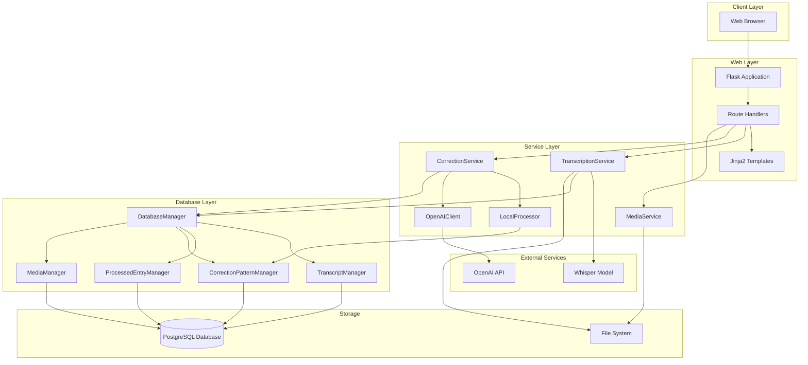
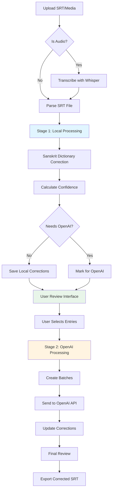
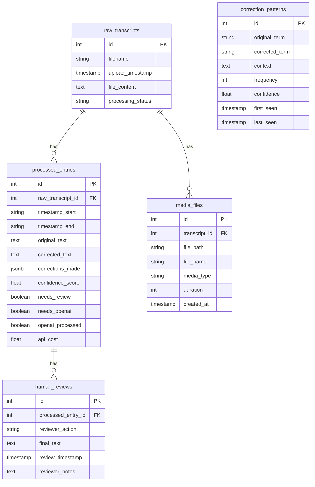
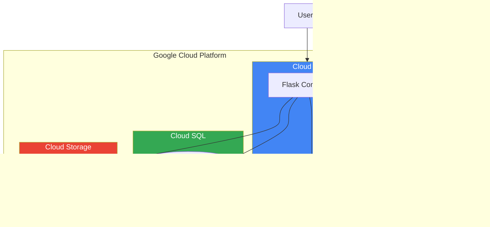
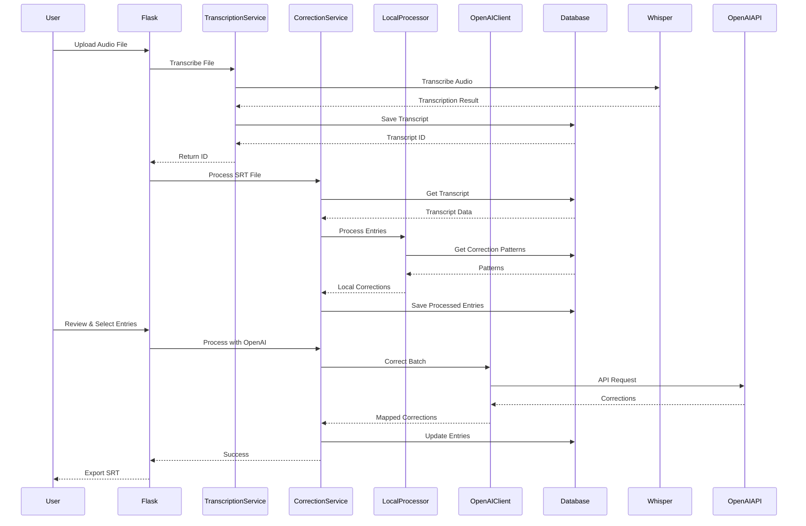

# System Architecture Diagram

## Overall System Architecture

```mermaid
graph TB
    subgraph Client[Client Layer]
        Browser[Web Browser]
    end
    
    subgraph Web[Web Layer]
        Flask[Flask Application]
        Routes[Route Handlers]
        Templates[Jinja2 Templates]
    end
    
    subgraph Services[Service Layer]
        Transcription[TranscriptionService]
        Correction[CorrectionService]
        Local[LocalProcessor]
        OpenAI[OpenAIClient]
        Media[MediaService]
    end
    
    subgraph Database[Database Layer]
        DBManager[DatabaseManager]
        TranscriptMgr[TranscriptManager]
        EntryMgr[ProcessedEntryManager]
        PatternMgr[CorrectionPatternManager]
        MediaMgr[MediaManager]
    end
    
    subgraph Storage[Storage]
        PostgreSQL[(PostgreSQL Database)]
        FileSystem[File System]
    end
    
    subgraph External[External Services]
        Whisper[Whisper Model]
        OpenAIAPI[OpenAI API]
    end
    
    Browser --> Flask
    Flask --> Routes
    Routes --> Templates
    Routes --> Transcription
    Routes --> Correction
    Routes --> Media
    
    Correction --> Local
    Correction --> OpenAI
    Correction --> DBManager
    
    Transcription --> Whisper
    Transcription --> DBManager
    
    Local --> PatternMgr
    OpenAI --> OpenAIAPI
    
    DBManager --> TranscriptMgr
    DBManager --> EntryMgr
    DBManager --> PatternMgr
    DBManager --> MediaMgr
    
    TranscriptMgr --> PostgreSQL
    EntryMgr --> PostgreSQL
    PatternMgr --> PostgreSQL
    MediaMgr --> PostgreSQL
    
    Media --> FileSystem
    Transcription --> FileSystem
```

## Two-Stage Correction Workflow

```mermaid
flowchart TD
    Start[Upload SRT/Media] --> Transcribe{Is Audio?}
    Transcribe -->|Yes| Whisper[Transcribe with Whisper]
    Transcribe -->|No| Parse[Parse SRT File]
    Whisper --> Parse
    
    Parse --> Stage1[Stage 1: Local Processing]
    Stage1 --> Sanskrit[Sanskrit Dictionary Correction]
    Sanskrit --> Confidence[Calculate Confidence]
    Confidence --> Flag{Needs OpenAI?}
    
    Flag -->|No| SaveLocal[Save Local Corrections]
    Flag -->|Yes| Mark[Mark for OpenAI]
    
    SaveLocal --> Review[User Review Interface]
    Mark --> Review
    
    Review --> Select[User Selects Entries]
    Select --> Stage2[Stage 2: OpenAI Processing]
    
    Stage2 --> Batch[Create Batches]
    Batch --> API[Send to OpenAI API]
    API --> Update[Update Corrections]
    Update --> FinalReview[Final Review]
    
    FinalReview --> Export[Export Corrected SRT]
    
    style Stage1 fill:#e1f5ff
    style Stage2 fill:#fff4e1
    style Review fill:#e8f5e9
```

## Database Schema

```mermaid
erDiagram
    raw_transcripts ||--o{ processed_entries : "has"
    raw_transcripts ||--o{ media_files : "has"
    processed_entries ||--o{ human_reviews : "has"
    
    raw_transcripts {
        int id PK
        string filename
        timestamp upload_timestamp
        text file_content
        string processing_status
    }
    
    processed_entries {
        int id PK
        int raw_transcript_id FK
        string timestamp_start
        string timestamp_end
        text original_text
        text corrected_text
        jsonb corrections_made
        float confidence_score
        boolean needs_review
        boolean needs_openai
        boolean openai_processed
        float api_cost
    }
    
    correction_patterns {
        int id PK
        string original_term
        string corrected_term
        text context
        int frequency
        float confidence
        timestamp first_seen
        timestamp last_seen
    }
    
    media_files {
        int id PK
        int transcript_id FK
        string file_path
        string file_name
        string media_type
        int duration
        timestamp created_at
    }
    
    human_reviews {
        int id PK
        int processed_entry_id FK
        string reviewer_action
        text final_text
        timestamp review_timestamp
        text reviewer_notes
    }
```

## Deployment Architecture

```mermaid
graph TB
    subgraph GCP[Google Cloud Platform]
        subgraph CloudRun[Cloud Run]
            Container[Flask Container]
            WhisperModel[Whisper Models]
        end
        
        subgraph CloudSQL[Cloud SQL]
            PostgreSQL[(PostgreSQL Database)]
        end
        
        subgraph CloudStorage[Cloud Storage]
            MediaFiles[Media Files]
        end
    end
    
    subgraph External[External Services]
        OpenAIAPI[OpenAI API]
    end
    
    Users[Users] --> CloudRun
    Container --> PostgreSQL
    Container --> CloudStorage
    Container --> OpenAIAPI
    Container --> WhisperModel
    
    style CloudRun fill:#4285f4,color:#fff
    style CloudSQL fill:#34a853,color:#fff
    style CloudStorage fill:#ea4335,color:#fff
```

## Service Interaction Flow

```mermaid
sequenceDiagram
    participant User
    participant Flask
    participant TranscriptionService
    participant CorrectionService
    participant LocalProcessor
    participant OpenAIClient
    participant Database
    
    User->>Flask: Upload Audio File
    Flask->>TranscriptionService: Transcribe File
    TranscriptionService->>Whisper: Transcribe Audio
    Whisper-->>TranscriptionService: Transcription Result
    TranscriptionService->>Database: Save Transcript
    Database-->>TranscriptionService: Transcript ID
    TranscriptionService-->>Flask: Return ID
    
    Flask->>CorrectionService: Process SRT File
    CorrectionService->>Database: Get Transcript
    Database-->>CorrectionService: Transcript Data
    
    CorrectionService->>LocalProcessor: Process Entries
    LocalProcessor->>Database: Get Correction Patterns
    Database-->>LocalProcessor: Patterns
    LocalProcessor-->>CorrectionService: Local Corrections
    CorrectionService->>Database: Save Processed Entries
    
    User->>Flask: Review & Select Entries
    Flask->>CorrectionService: Process with OpenAI
    CorrectionService->>OpenAIClient: Correct Batch
    OpenAIClient->>OpenAIAPI: API Request
    OpenAIAPI-->>OpenAIClient: Corrections
    OpenAIClient-->>CorrectionService: Mapped Corrections
    CorrectionService->>Database: Update Entries
    CorrectionService-->>Flask: Success
    Flask-->>User: Export SRT
```
