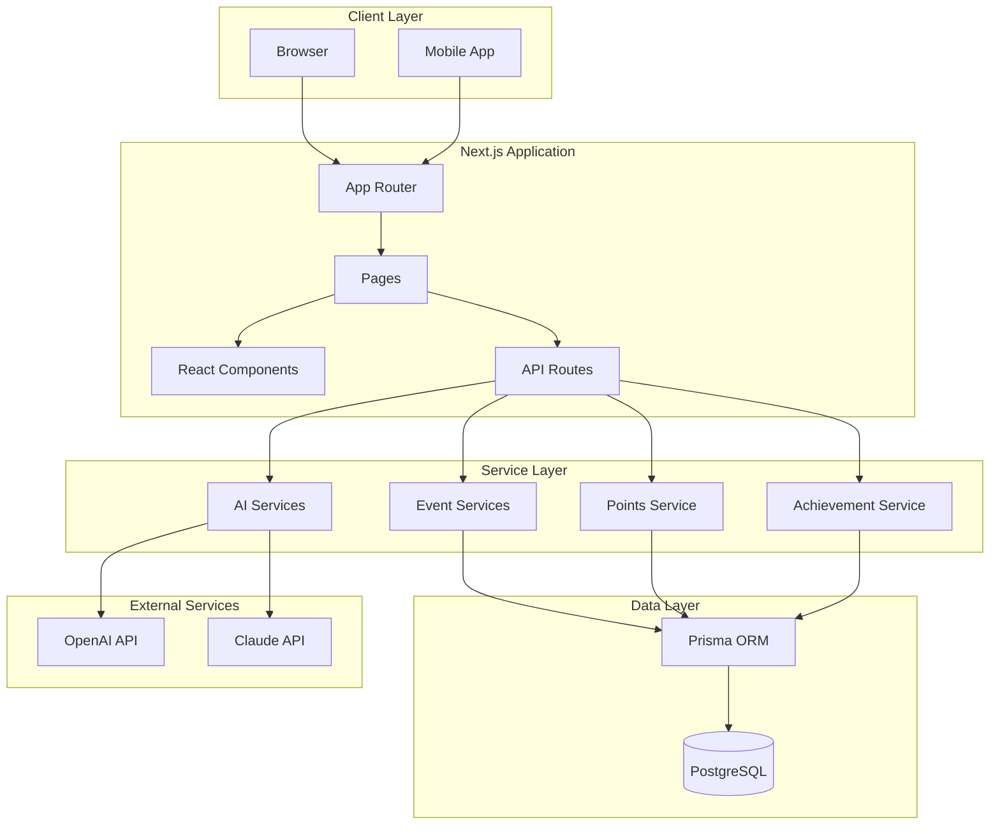
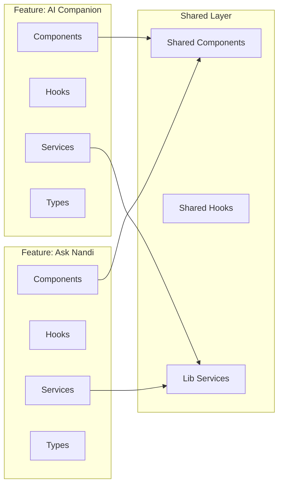
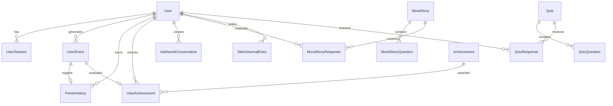
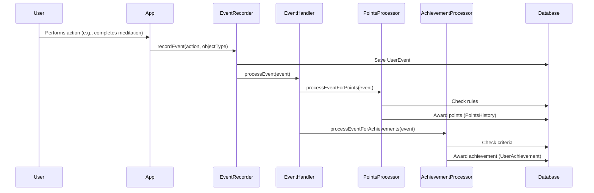
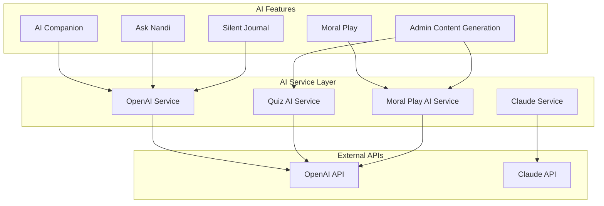
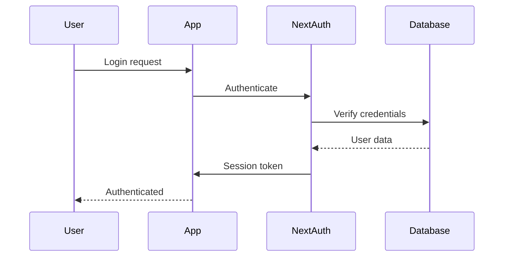

# Architecture

This document describes the system architecture of the Nandi Mindfulness App - a comprehensive AI-powered spiritual wellness platform.

## System Overview

The Nandi Mindfulness App is built as a full-stack Next.js application with a feature-based architecture, event-driven gamification system, and comprehensive AI integration. The application uses PostgreSQL with Prisma ORM for data persistence and implements a service-oriented design pattern.

## Architecture Principles

1. **Feature-Based Organization**: Code organized by domain/feature rather than technical layer
2. **Type Safety**: Full TypeScript coverage with Prisma-generated types
3. **Event-Driven Design**: Decoupled event system for points, achievements, and analytics
4. **Service Layer**: Business logic separated into reusable services
5. **API-First**: OpenAPI/Swagger documentation for all endpoints
6. **Modular Design**: Self-contained features with clear boundaries

## System Architecture

### High-Level Architecture



## Next.js 14 App Router Structure

The application uses Next.js 14's App Router with the following structure:

```
app/
├── (auth)/              # Authentication routes
│   ├── login/
│   └── register/
├── (dashboard)/         # Protected dashboard routes
│   ├── home/
│   ├── ask/
│   ├── moral-play/
│   ├── journal/
│   └── activity/
├── api/                 # API routes
│   ├── admin/          # Admin endpoints
│   ├── auth/           # Authentication endpoints
│   ├── nandi/          # AI companion endpoints
│   └── ...
└── layout.tsx          # Root layout
```

### Route Organization

- **Route Groups**: `(auth)` and `(dashboard)` organize routes without affecting URLs
- **API Routes**: Serverless functions for backend logic
- **Server Components**: Default rendering for better performance
- **Client Components**: Used only when interactivity is needed

## Feature-Based Architecture

The application follows a feature-based organization pattern where code is grouped by business domain rather than technical layer.

### Feature Structure

```
src/features/
├── main/                # Main user features
│   ├── nandi/          # AI Companion
│   │   ├── components/
│   │   ├── hooks/
│   │   ├── services/
│   │   └── types/
│   ├── ask/            # Ask Nandi
│   ├── moral-play/      # Moral Play
│   ├── silent-journal/  # Silent Journal
│   └── activity-dashboard/
├── admin/               # Admin features
│   ├── achievements/
│   ├── content-generation/
│   ├── users/
│   └── beta-management/
└── shared/              # Shared features
    ├── components/
    └── hooks/
```

### Feature Architecture Diagram



### Benefits of Feature-Based Architecture

1. **Modularity**: Each feature is self-contained
2. **Discoverability**: Easy to find all code related to a feature
3. **Maintainability**: Changes isolated to specific features
4. **Scalability**: New features added without affecting existing ones
5. **Team Collaboration**: Teams can work on different features independently

## Database Architecture

### PostgreSQL + Prisma ORM

The application uses PostgreSQL as the primary database with Prisma ORM for type-safe database access.

### Database Schema Overview



### Prisma ORM Patterns

**Type-Safe Queries:**
```typescript
// Prisma generates types from schema
const user = await prisma.user.findUnique({
  where: { id: userId },
  include: {
    pointsHistory: true,
    achievements: true
  }
});
```

**Relationships:**
- One-to-many: User → UserEvents
- Many-to-many: User ↔ Achievements (through UserAchievement)
- Cascading deletes: User deletion removes related records

**Indexing Strategy:**
- Single field indexes for common queries
- Composite indexes for complex queries
- GIN indexes for array fields (tags, etc.)

## Event-Driven System Architecture

The application implements an event-driven architecture for gamification, points, and achievements.

### Event Flow



### Event System Components

1. **Event Recorder** (`lib/events/eventRecorder.server.ts`)
   - Records user events to database
   - Triggers event processing

2. **Event Handler** (`lib/events/eventHandler.server.ts`)
   - Processes events through all systems
   - Coordinates points and achievement processing

3. **Points Processor** (`lib/points/pointsProcessor.server.ts`)
   - Awards points based on event rules
   - Tracks points history

4. **Achievement Processor** (`lib/achievements/achievementProcessor.server.ts`)
   - Evaluates achievement criteria
   - Awards achievements when criteria met

### Rule-Based Configuration

Events are processed using configurable rules:

```typescript
// Example rule configuration
{
  pattern: {
    action: 'completed',
    objectType: 'meditation'
  },
  outcome: {
    type: 'award_points',
    category: 'MINDFULNESS',
    basePoints: 10
  }
}
```

## AI Integration Architecture

The application integrates multiple AI services for various features.

### AI Service Architecture



### AI Service Patterns

**Service Wrapper:**
```typescript
// Centralized OpenAI service
class OpenAIService {
  async callOpenAI(messages, options) {
    // Retry logic, error handling, timeout
  }
}
```

**Feature-Specific Services:**
- `QuizAIService` - Generates quiz questions
- `MoralPlayAIService` - Generates moral stories
- `AskNandiService` - Handles philosophical conversations

**Prompt Engineering:**
- System prompts for context
- User prompts for specific requests
- Response validation and parsing

## State Management

### Zustand Stores

The application uses Zustand for global state management:

```typescript
// Example store
const useAuthStore = create((set) => ({
  user: null,
  isAuthenticated: false,
  setUser: (user) => set({ user, isAuthenticated: !!user })
}));
```

### State Management Strategy

- **Global State**: Zustand stores for auth, user preferences
- **Local State**: React hooks (`useState`, `useReducer`) for component state
- **Server State**: React Query or direct API calls for server data
- **Form State**: React Hook Form for form management

## Service Layer Design

### Service Organization

```
src/lib/
├── ai/                  # AI services
│   ├── core/           # Core AI service (OpenAI wrapper)
│   └── features/       # Feature-specific AI services
├── events/             # Event system
├── points/             # Points system
├── achievements/       # Achievement system
├── activity/           # Activity tracking
└── core/               # Core services (DB, auth, etc.)
```

### Service Patterns

**Service Interface:**
```typescript
// Consistent service pattern
export class PointsService {
  async awardPoints(params: AwardPointsParams): Promise<void> {
    // Business logic
  }
  
  async getUserTotalPoints(userId: string): Promise<number> {
    // Data access
  }
}
```

**Error Handling:**
- Consistent error types
- Proper error propagation
- Logging and monitoring

## API Architecture

### API Route Organization

```
app/api/
├── admin/              # Admin endpoints
│   ├── content/       # Content generation
│   ├── users/         # User management
│   └── achievements/  # Achievement management
├── auth/              # Authentication
├── nandi/             # AI companion
├── ask-nandi/         # Ask Nandi feature
└── ...
```

### API Patterns

**Authentication:**
- NextAuth.js for session management
- Role-based access control (RBAC)
- API route protection middleware

**Response Format:**
```typescript
// Standardized responses
{
  success: boolean,
  data?: T,
  error?: string,
  message?: string
}
```

**OpenAPI Documentation:**
- Swagger/OpenAPI specification
- Auto-generated API docs
- Type-safe API clients

## Security Architecture

### Authentication Flow



### Security Measures

1. **Authentication**: NextAuth.js with multiple providers
2. **Authorization**: Role-based access control (RBAC)
3. **Input Validation**: Zod schemas for API inputs
4. **SQL Injection Prevention**: Prisma parameterized queries
5. **XSS Protection**: React's built-in escaping
6. **CSRF Protection**: NextAuth.js CSRF tokens

## Performance Optimization

### Strategies

1. **Server Components**: Default rendering for better performance
2. **Code Splitting**: Dynamic imports for large components
3. **Image Optimization**: Next.js Image component
4. **Database Optimization**: Indexed queries, connection pooling
5. **Caching**: React Query for API responses
6. **Lazy Loading**: Components loaded on demand

## Deployment Architecture

### Production Setup

- **Hosting**: Vercel/Next.js deployment
- **Database**: Managed PostgreSQL (e.g., Supabase, Railway)
- **Environment Variables**: Secure secret management
- **CI/CD**: Automated testing and deployment
- **Monitoring**: Error tracking and analytics

## Conclusion

The Nandi Mindfulness App architecture emphasizes:

- **Modularity**: Feature-based organization
- **Type Safety**: Full TypeScript and Prisma types
- **Scalability**: Event-driven, service-oriented design
- **Maintainability**: Clear separation of concerns
- **Performance**: Optimized rendering and data access
- **Security**: Comprehensive authentication and authorization

This architecture supports a complex application with 25+ features, 95+ API routes, and sophisticated AI integration while maintaining code quality and developer experience.
