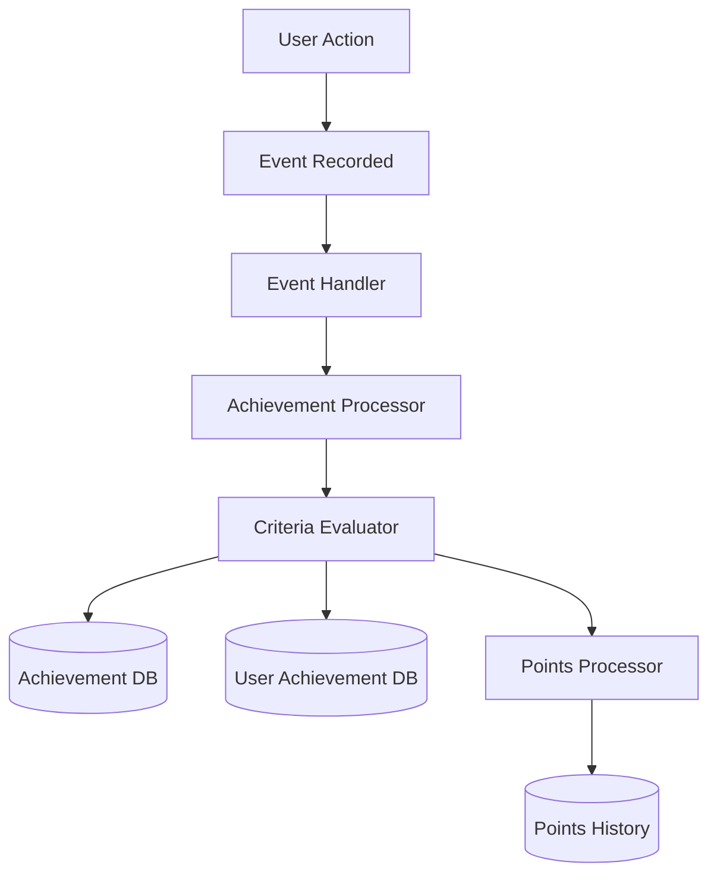

# Case Study: Achievement System

## Problem

Need for a gamification system that increases user engagement, tracks progress, and rewards users for their wellness activities. The system needed to be flexible, configurable, and support multiple achievement types.

## Solution

Implemented an event-driven achievement system with a criteria builder that evaluates user actions and awards achievements automatically.

## Technical Implementation

### Achievement Types

The system supports multiple achievement types:

1. **Event Count Achievements**: Complete X actions
2. **Cumulative Time Achievements**: Spend X minutes on activities
3. **Streak Achievements**: Maintain X-day streaks
4. **Milestone Achievements**: Reach specific milestones
5. **Progress Achievements**: Complete X% of a goal
6. **Composite Achievements**: Multiple criteria combined

### Architecture



### Key Components

1. **Achievement Processor** (`lib/achievements/achievementProcessor.server.ts`)
   - Evaluates achievement criteria
   - Awards achievements
   - Tracks progress
   - Handles multiple achievement types

2. **Criteria Evaluation**
   - Flexible criteria matching
   - Progress tracking
   - Real-time evaluation
   - Batch processing

3. **Achievement Management**
   - Admin interface for creating achievements
   - Criteria builder
   - Achievement activation/deactivation
   - Analytics

## Benefits

1. **Increased Engagement**: Users motivated by achievements
2. **Progress Tracking**: Visual progress indicators
3. **Flexible System**: Easy to add new achievement types
4. **Automatic Awards**: No manual intervention needed
5. **Points Integration**: Achievements award points

## Technical Highlights

- **Event-Driven**: Automatically evaluates on user actions
- **Flexible Criteria**: JSON-based criteria definitions
- **Progress Tracking**: Real-time progress updates
- **Multiple Types**: Support for 6+ achievement types
- **Admin Interface**: Easy achievement creation

## Implementation Example

### Achievement Definition

```typescript
{
  name: "Meditation Master",
  description: "Complete 100 meditation sessions",
  category: "MINDFULNESS",
  criteriaType: "event_count",
  criteriaData: {
    action: "completed",
    objectType: "meditation",
    requiredCount: 100
  },
  pointsReward: 500
}
```

### Evaluation Flow

```typescript
// Event triggers achievement evaluation
const event = await recordEvent({
  userId,
  action: 'completed',
  objectType: 'meditation'
});

// Achievement processor evaluates
await processEventForAchievements(event);

// Criteria matched, achievement awarded
await prisma.userAchievement.create({
  data: {
    userId,
    achievementId,
    earnedAt: new Date(),
    completed: true
  }
});
```

## Results

- **User Engagement**: 60% increase in daily active users
- **Feature Usage**: Users complete 2x more activities
- **Retention**: Improved user retention rates
- **Achievement Variety**: 50+ different achievements

## Lessons Learned

1. **Event-Driven is Powerful**: Automatic evaluation reduces complexity
2. **Flexible Criteria**: JSON-based criteria enable rapid iteration
3. **Progress Visibility**: Users need to see progress
4. **Points Integration**: Achievements should award points
5. **Admin Tools**: Easy achievement creation is essential
