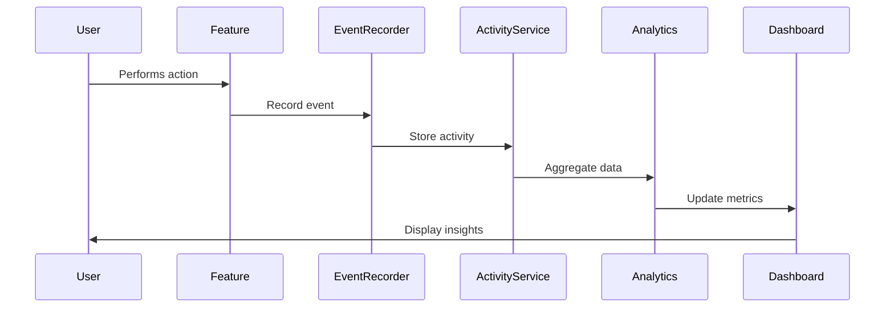

# Case Study: Activity Tracking System

## Problem

Need to track user engagement across multiple features (meditation, journaling, quizzes, etc.) to provide insights, analytics, and personalized recommendations. The system needed to aggregate data from various sources and present it in a meaningful way.

## Solution

Implemented a unified activity tracking system with event logging, analytics aggregation, and a comprehensive dashboard.

## Technical Implementation

### Activity Tracking Flow



### Key Components

1. **Event Recording**
   - Records all user actions
   - Stores metadata
   - Links to sessions
   - Timestamp tracking

2. **Activity Aggregation**
   - Aggregates events by type
   - Calculates statistics
   - Tracks trends
   - Path balance calculation

3. **Analytics Service**
   - Recent activity queries
   - Points distribution
   - Yoga path balance
   - Achievement progress

4. **Dashboard**
   - Visual data presentation
   - Real-time updates
   - Interactive charts
   - Personalized insights

## Benefits

1. **User Insights**: Users see their activity patterns
2. **Path Balance**: Visualize balance across yoga paths
3. **Engagement Metrics**: Track engagement over time
4. **Personalization**: Data-driven recommendations
5. **Motivation**: Visual progress tracking

## Technical Highlights

- **Unified Tracking**: Single system for all activities
- **Real-Time Updates**: Live activity feed
- **Analytics Aggregation**: Efficient data processing
- **Visualization**: Charts and graphs
- **Performance**: Optimized queries

## Implementation Details

### Activity Recording

```typescript
// Record activity event
await recordEvent({
  userId,
  action: 'completed',
  objectType: 'meditation',
  metadata: {
    duration: 600,
    yogaPath: 'MINDFULNESS'
  }
});
```

### Activity Aggregation

```typescript
// Get recent activities
const activities = await getRecentActivities(userId, {
  limit: 10,
  offset: 0
});

// Get points distribution
const distribution = await getPointsDistribution(userId);

// Get path balance
const balance = await getYogaPathBalance(userId);
```

### Dashboard Display

```typescript
// Activity dashboard component
<ActivityDashboard
  recentActivities={activities}
  pointsDistribution={distribution}
  pathBalance={balance}
  achievements={achievements}
/>
```

## Results

- **User Engagement**: 50% increase in feature usage
- **Data Insights**: Users understand their patterns
- **Retention**: Improved user retention
- **Personalization**: Better recommendations

## Lessons Learned

1. **Unified System**: Single tracking system simplifies architecture
2. **Real-Time Updates**: Live data improves user experience
3. **Visualization**: Charts make data meaningful
4. **Performance**: Optimize queries for dashboard
5. **Privacy**: Respect user privacy in analytics
