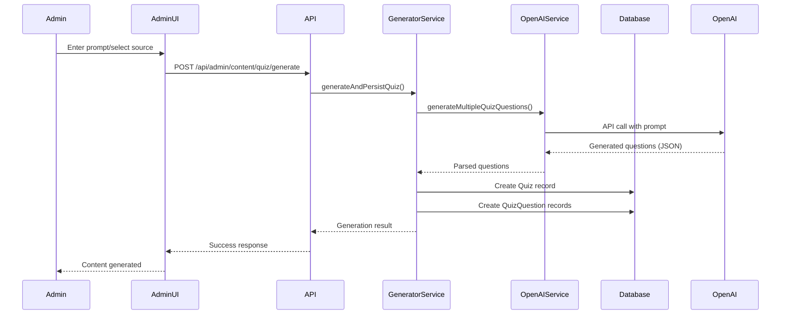

# Case Study: Admin AI Content Generation

## Problem

Need to efficiently populate the database with quizzes and moral stories. Manual content creation was time-consuming and inconsistent. The system needed to support both AI-generated content and loading from curated "golden source" files.

## Solution

Implemented an admin dashboard with OpenAI-powered content generation that uses prompts to generate quizzes and stories, then automatically populates the database.

## Technical Implementation

### Content Generation Flow



### Key Components

1. **Quiz Generator Service** (`features/admin/content-generation/services/quiz-generator.ts`)
   - Generates quizzes using AI
   - Loads from golden source
   - Persists to database
   - Validates content

2. **Story Generator Service** (`features/admin/content-generation/services/story-generator.ts`)
   - Generates moral stories using AI
   - Loads from golden source
   - Creates questions
   - Persists to database

3. **OpenAI Integration** (`lib/ai/core/openai.service.ts`)
   - Centralized OpenAI API wrapper
   - Retry logic
   - Error handling
   - Timeout management

4. **Admin UI** (`features/admin/content-generation/components/`)
   - Quiz generation form
   - Story generation form
   - Content generation dashboard
   - Generation history

## Benefits

1. **Automated Content Creation**: Generate content quickly
2. **Consistent Quality**: AI ensures consistent format
3. **Scalable**: Generate multiple items at once
4. **Golden Source Support**: Load curated content
5. **Database Integration**: Automatic persistence

## Technical Highlights

- **OpenAI Integration**: GPT-4 for content generation
- **Prompt Engineering**: Optimized prompts for quality
- **JSON Parsing**: Robust parsing and validation
- **Database Persistence**: Automatic Prisma persistence
- **Error Handling**: Comprehensive error handling

## Implementation Details

### Quiz Generation

```typescript
// Generate quiz from prompt
const result = await quizGenerator.generateAndPersistQuiz({
  prompt: "Mindfulness meditation basics",
  category: "MINDFULNESS",
  count: 5,
  createdById: adminUserId
});

// Result includes:
// - quizId
// - questionsGenerated
// - success status
```

### Story Generation

```typescript
// Generate story from category
const result = await storyGenerator.generateAndPersistStory({
  category: "ZEN_PARABLES",
  createdById: adminUserId
});

// Or load from golden source
const result = await storyGenerator.generateAndPersistStory({
  storyPath: "zen-mindful-service.json",
  createdById: adminUserId
});
```

### OpenAI Integration

```typescript
// OpenAI service call
const response = await openaiService.callOpenAI([
  { role: 'system', content: QUIZ_SYSTEM_PROMPT },
  { role: 'user', content: createQuizQuestionPrompt(prompt) }
], {
  temperature: 0.7,
  maxTokens: 1000
});

// Parse and validate response
const questions = parseAndValidateResponse(response);
```

## Results

- **Content Generation**: 10x faster than manual creation
- **Quality**: Consistent format and structure
- **Scalability**: Generate hundreds of items
- **Database Population**: Automatic persistence
- **Admin Efficiency**: Reduced content creation time

## Lessons Learned

1. **Prompt Engineering**: Quality prompts produce quality content
2. **JSON Parsing**: Robust parsing is essential
3. **Validation**: Always validate generated content
4. **Error Handling**: Handle API failures gracefully
5. **Golden Source**: Curated content ensures quality
