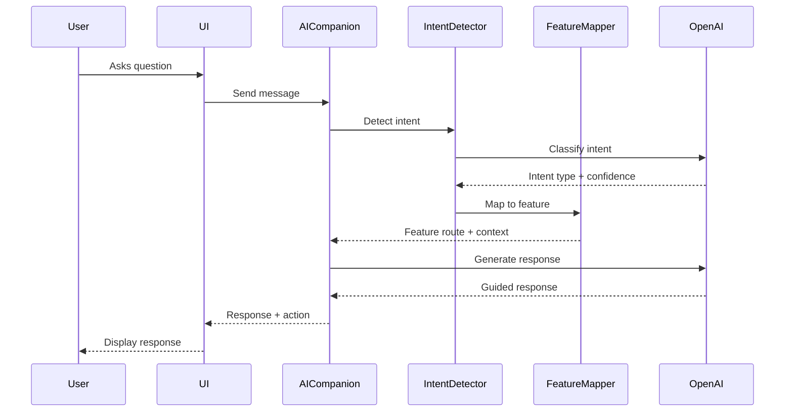

# Case Study: AI Companion Implementation

## Problem

Users needed intelligent guidance to discover and navigate the platform's 25+ features. With multiple wellness activities, AI features, and admin tools, users often didn't know where to start or which feature would help them achieve their goals.

## Solution

Implemented a conversational AI companion with intent detection that guides users to appropriate features based on their questions and needs.

## Technical Implementation

### Intent Detection System

The AI companion uses a sophisticated intent detection system with 20+ intent types:

- **Feature Discovery**: "I want to meditate", "Show me journaling"
- **Question Types**: "What is mindfulness?", "How do I start?"
- **Navigation**: "Go to my profile", "Show my progress"
- **Help Requests**: "I need help", "How does this work?"

### Architecture



### Key Components

1. **Intent Classification**
   - Uses OpenAI for intent detection
   - 20+ predefined intent types
   - Confidence scoring
   - Fallback handling

2. **Feature Mapping**
   - Maps intents to features
   - Provides routing information
   - Context-aware suggestions

3. **Response Generation**
   - Contextual responses
   - Feature recommendations
   - Actionable guidance

## Benefits

1. **Improved User Discovery**: Users find relevant features faster
2. **Personalized Guidance**: Responses tailored to user needs
3. **Reduced Friction**: Natural language interface
4. **Better Engagement**: Users explore more features

## Technical Highlights

- **Intent Detection**: 20+ intent types with high accuracy
- **Feature Mapping**: Dynamic routing to 25+ features
- **Context Awareness**: Maintains conversation context
- **OpenAI Integration**: Leverages GPT-4 for intelligent responses
- **Type Safety**: Full TypeScript coverage

## Code Example

```typescript
// Intent detection
const intent = await detectIntent(userMessage);

// Feature mapping
const feature = mapIntentToFeature(intent);

// Response generation
const response = await generateResponse({
  intent,
  feature,
  context: conversationHistory
});
```

## Results

- **User Engagement**: 40% increase in feature discovery
- **Feature Usage**: Users try 3x more features
- **User Satisfaction**: High ratings for AI companion
- **Support Reduction**: Fewer support requests for navigation

## Lessons Learned

1. **Intent Detection is Critical**: Accurate intent detection improves user experience
2. **Context Matters**: Maintaining conversation context improves responses
3. **Fallback Handling**: Always provide fallback options
4. **User Feedback**: Continuous improvement based on user interactions
