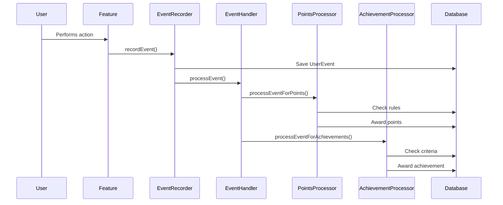

# Case Study: Event-Driven Points/Reward System

## Problem

Need for a flexible, configurable reward system that responds to user actions across multiple features. The system needed to be decoupled, extensible, and support rule-based points distribution and achievement evaluation.

## Solution

Implemented an event-driven architecture with rule-based points and achievement processing that automatically responds to user actions.

## Technical Implementation

### Event-Driven Flow



### Key Components

1. **Event Recorder** (`lib/events/eventRecorder.server.ts`)
   - Records user events
   - Stores metadata
   - Triggers processing

2. **Event Handler** (`lib/events/eventHandler.server.ts`)
   - Processes events
   - Coordinates points and achievements
   - Pattern matching

3. **Points Processor** (`lib/points/pointsProcessor.server.ts`)
   - Awards points based on rules
   - Tracks points history
   - Supports multipliers

4. **Achievement Processor** (`lib/achievements/achievementProcessor.server.ts`)
   - Evaluates achievement criteria
   - Awards achievements
   - Tracks progress

### Rule-Based Configuration

Events are processed using configurable rules:

```typescript
// Example rule
{
  pattern: {
    action: 'completed',
    objectType: 'meditation'
  },
  outcome: {
    type: 'award_points',
    category: 'MINDFULNESS',
    basePoints: 10
  },
  description: 'Completed meditation session'
}
```

## Benefits

1. **Decoupled Design**: Features don't need to know about rewards
2. **Configurable Rules**: Easy to modify point values
3. **Automatic Rewards**: No manual intervention needed
4. **Extensible**: Easy to add new rules and outcomes
5. **Consistent**: Same system for all features

## Technical Highlights

- **Event-Driven**: Decoupled architecture
- **Rule-Based**: Configurable point rules
- **Pattern Matching**: Flexible event matching
- **Automatic Processing**: No manual triggers needed
- **Scalable**: Handles high event volume

## Implementation Details

### Event Recording

```typescript
// Record event (any feature can do this)
await recordEvent({
  userId,
  action: 'completed',
  objectType: 'meditation',
  metadata: {
    duration: 600,
    yogaPath: 'MINDFULNESS'
  }
});
```

### Rule Processing

```typescript
// Event handler processes event
async function processEvent(event: UserEvent) {
  // Process for points
  await processEventForPoints(event);
  
  // Process for achievements
  await processEventForAchievements(event);
}
```

### Points Awarding

```typescript
// Points processor awards points
await awardPoints({
  userId: event.userId,
  points: 10,
  source: 'meditation',
  eventId: event.id,
  metadata: { ... }
});
```

## Results

- **Flexibility**: Easy to modify reward rules
- **Consistency**: Same system across all features
- **Automation**: No manual reward processing
- **Scalability**: Handles high event volume
- **Maintainability**: Centralized reward logic

## Lessons Learned

1. **Event-Driven is Powerful**: Decoupled architecture simplifies system
2. **Rule-Based Configuration**: Makes system flexible
3. **Pattern Matching**: Enables complex event matching
4. **Automatic Processing**: Reduces manual work
5. **Error Handling**: Robust error handling is critical
