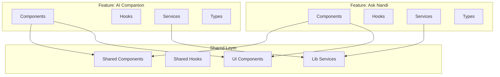

# Case Study: Feature-Based Architecture

## Problem

With 25+ features and growing, the codebase needed a scalable organization pattern. Traditional layer-based organization (components, services, utils) made it difficult to find feature-related code and maintain feature boundaries.

## Solution

Implemented a feature-based architecture where code is organized by business domain/feature rather than technical layer.

## Technical Implementation

### Architecture Pattern

```
src/features/
├── main/                # Main user features
│   ├── nandi/          # AI Companion feature
│   │   ├── components/
│   │   ├── hooks/
│   │   ├── services/
│   │   └── types/
│   ├── ask/            # Ask Nandi feature
│   ├── moral-play/      # Moral Play feature
│   └── silent-journal/  # Silent Journal feature
├── admin/               # Admin features
│   ├── achievements/
│   ├── content-generation/
│   └── users/
└── shared/              # Shared features
    ├── components/
    └── hooks/
```

### Feature Structure

Each feature follows a consistent structure:

```
feature-name/
├── components/     # UI components specific to this feature
├── hooks/          # React hooks for feature-specific logic
├── services/       # API and other services for this feature
├── types/          # TypeScript types and interfaces
└── utils/          # Utility functions specific to this feature
```

### Architecture Diagram



## Benefits

1. **Modularity**: Each feature is self-contained
2. **Discoverability**: Easy to find all code related to a feature
3. **Maintainability**: Changes isolated to specific features
4. **Scalability**: New features added without affecting existing ones
5. **Team Collaboration**: Teams can work on different features independently

## Technical Highlights

- **25+ Features**: Organized by business domain
- **Consistent Structure**: All features follow same pattern
- **Clear Boundaries**: Features are independent
- **Shared Code**: Common code in shared/lib directories
- **Type Safety**: Full TypeScript coverage

## Implementation Principles

1. **Feature Isolation**: Features don't directly depend on each other
2. **Shared Code**: Common functionality in shared/lib
3. **Service Layer**: Business logic in services
4. **Type Safety**: Types defined per feature
5. **Documentation**: Each feature can have its own README

## Code Organization Example

```typescript
// Feature: AI Companion
// features/main/nandi/services/companionService.ts
export class CompanionService {
  async detectIntent(message: string) {
    // Feature-specific logic
  }
}

// Feature: Ask Nandi
// features/main/ask/services/askService.ts
export class AskService {
  async generateConversation(prompt: string) {
    // Feature-specific logic
  }
}

// Shared service
// lib/ai/core/openai.service.ts
export class OpenAIService {
  async callOpenAI(messages: any[]) {
    // Shared AI logic
  }
}
```

## Results

- **Code Organization**: 25+ features clearly organized
- **Developer Experience**: Easier to find and modify code
- **Maintainability**: Changes isolated to features
- **Scalability**: Easy to add new features
- **Team Productivity**: Parallel development on features

## Lessons Learned

1. **Start with Features**: Organize by business domain from the start
2. **Consistent Structure**: Same structure across all features
3. **Shared Code**: Balance between feature isolation and code reuse
4. **Documentation**: Feature READMEs help onboarding
5. **Refactoring**: Gradually migrate to feature-based structure
