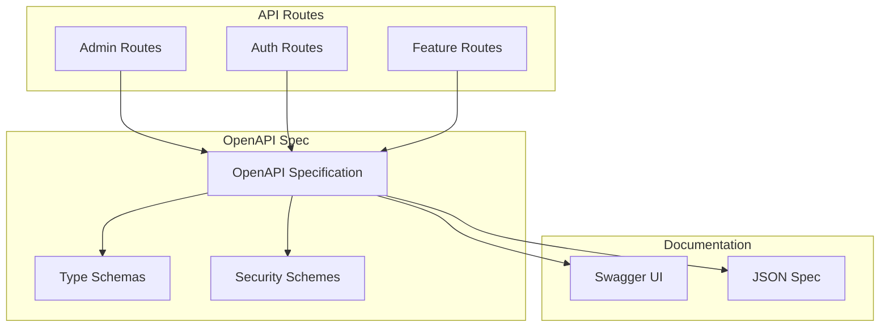

# Case Study: OpenAPI API Architecture

## Problem

With 95+ API routes across multiple features, maintaining comprehensive API documentation, ensuring type safety, and enabling API discoverability was challenging. Manual documentation was error-prone and quickly became outdated.

## Solution

Implemented OpenAPI/Swagger integration with auto-generated documentation, type-safe schemas, and interactive API explorer.

## Technical Implementation

### OpenAPI Specification

Created a comprehensive OpenAPI 3.0 specification covering:

- **95+ Endpoints**: All API routes documented
- **Request/Response Schemas**: Type-safe schemas for all endpoints
- **Authentication**: Security schemes documented
- **Error Responses**: Standardized error formats
- **Examples**: Request/response examples

### Architecture



### Key Components

1. **OpenAPI Specification** (`lib/core/openapi.server.ts`)
   - Centralized API definition
   - Schema definitions
   - Security schemes
   - Tag organization

2. **Swagger UI Integration**
   - Interactive API explorer
   - Endpoint testing
   - Schema visualization
   - Authentication support

3. **Type Generation**
   - TypeScript types from schemas
   - Request/response types
   - Validation schemas

## Benefits

1. **Auto-Generated Docs**: Always up-to-date documentation
2. **Type Safety**: Type-safe API clients
3. **API Discoverability**: Easy to explore and understand APIs
4. **Developer Experience**: Better DX for API consumers
5. **Consistency**: Standardized request/response formats

## Technical Highlights

- **95+ Documented Routes**: Comprehensive API coverage
- **OpenAPI 3.0**: Modern API specification standard
- **Swagger UI**: Interactive documentation
- **Type Safety**: Generated TypeScript types
- **Security Documentation**: Authentication schemes documented

## Implementation Details

### Specification Structure

```typescript
const swaggerSpec = {
  openapi: '3.0.0',
  info: {
    title: 'Nandi API',
    version: '1.0.0',
    description: 'API documentation for the Nandi application'
  },
  servers: [
    { url: process.env.NEXT_PUBLIC_API_URL || 'http://localhost:3000' }
  ],
  tags: [
    { name: 'Admin', description: 'Administrative endpoints' },
    { name: 'Auth', description: 'Authentication endpoints' },
    // ... more tags
  ],
  paths: {
    '/api/admin/users': {
      get: { /* endpoint definition */ },
      patch: { /* endpoint definition */ }
    },
    // ... more paths
  },
  components: {
    schemas: {
      User: { /* schema definition */ },
      Error: { /* schema definition */ }
    },
    securitySchemes: {
      bearerAuth: { type: 'http', scheme: 'bearer' }
    }
  }
};
```

### Documentation Endpoint

```typescript
// app/api/docs/route.ts
export async function GET() {
  return NextResponse.json(swaggerSpec);
}
```

## Results

- **Documentation Coverage**: 100% of API routes documented
- **Developer Adoption**: Faster API integration
- **Type Safety**: Reduced runtime errors
- **Maintenance**: Easier to maintain and update

## Lessons Learned

1. **Start Early**: Document APIs from the beginning
2. **Keep It Updated**: Automate documentation updates
3. **Use Standards**: OpenAPI provides industry-standard format
4. **Interactive Docs**: Swagger UI significantly improves DX
5. **Type Generation**: Auto-generated types reduce errors
