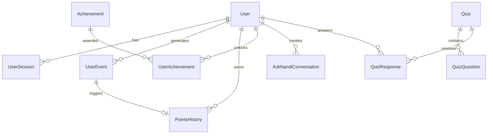

# Case Study: Prisma ORM Data Model

## Problem

Need for type-safe database access, complex relationships, and maintainable database schema. Traditional SQL queries are error-prone and don't provide type safety. Manual type definitions become out of sync with the database.

## Solution

Implemented Prisma ORM (Hibernate-like for TypeScript) with 20+ models, complex relationships, and automatic type generation.

## Technical Implementation

### Prisma ORM Overview

Prisma is a next-generation ORM that provides:

- **Type Safety**: Auto-generated TypeScript types
- **Migrations**: Version-controlled schema changes
- **Relationships**: Declarative relationship definitions
- **Query Builder**: Type-safe query API
- **Performance**: Optimized queries

### Database Schema

**20+ Models** covering all application domains:

- User Management: User, UserSession, UserPreference
- Gamification: PointsHistory, UserAchievement, Achievement
- Events: UserEvent
- AI Features: AskNandiConversation, AskNandiReflection
- Content: Quiz, QuizQuestion, MoralStory, MoralStoryQuestion
- Journaling: SilentJournalEntry, ReflectionJournalEntry
- Analytics: ActivityOccurrence, MoodLog

### Architecture



## Benefits

1. **Type Safety**: Compile-time error detection
2. **Developer Experience**: Excellent IDE support
3. **Migrations**: Version-controlled schema changes
4. **Relationships**: Automatic relationship handling
5. **Performance**: Optimized queries

## Technical Highlights

- **20+ Models**: Comprehensive data model
- **Type Generation**: Auto-generated TypeScript types
- **Relationships**: One-to-many, many-to-many, cascading deletes
- **Indexes**: Strategic indexing for performance
- **Migrations**: Version-controlled schema evolution

## Implementation Examples

### Schema Definition

```prisma
model User {
  id            String   @id @default(dbgenerated("gen_random_uuid()"))
  userId        String   @unique
  email         String?  @unique
  role          String   @default("user")
  createdAt     DateTime @default(now())
  updatedAt     DateTime @updatedAt
  
  // Relationships
  userEvents    UserEvent[]
  pointsHistory PointsHistory[]
  achievements  UserAchievement[]
  
  @@index([email])
  @@index([role])
}
```

### Type-Safe Queries

```typescript
// Type-safe query with includes
const user = await prisma.user.findUnique({
  where: { id: userId },
  include: {
    pointsHistory: true,
    achievements: {
      include: {
        achievement: true
      }
    }
  }
});

// Type is automatically inferred
// user: User & { pointsHistory: PointsHistory[], achievements: UserAchievement[] }
```

### Aggregations

```typescript
// Type-safe aggregation
const totalPoints = await prisma.pointsHistory.aggregate({
  where: { userId },
  _sum: {
    pointsEarned: true
  }
});
```

### Transactions

```typescript
// Type-safe transactions
await prisma.$transaction([
  prisma.userEvent.create({ data: eventData }),
  prisma.pointsHistory.create({ data: pointsData })
]);
```

## Results

- **Type Safety**: 100% type coverage
- **Developer Experience**: Faster development
- **Error Reduction**: Compile-time error detection
- **Maintainability**: Easier schema evolution
- **Performance**: Optimized queries

## Lessons Learned

1. **Start with Schema**: Define schema first, types generated automatically
2. **Use Relationships**: Leverage Prisma relationships
3. **Index Strategically**: Index frequently queried fields
4. **Migrations**: Use migrations for all schema changes
5. **Type Utilities**: Use Prisma utility types for complex queries
