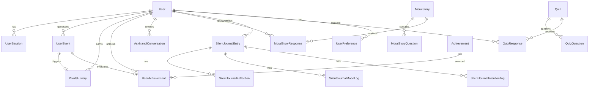

# Data Model

This document describes the database architecture and Prisma ORM patterns used in the Nandi Mindfulness App.

## Overview

The Nandi Mindfulness App uses **PostgreSQL** as the primary database with **Prisma ORM** for type-safe database access. The database schema consists of **20+ models** with complex relationships, indexes, and type-safe queries.

## Prisma ORM

### What is Prisma?

Prisma is a next-generation ORM (Object-Relational Mapping) for TypeScript and Node.js. It's similar to Hibernate (Java) but designed specifically for TypeScript/JavaScript applications.

### Key Features

1. **Type Safety**: Auto-generated TypeScript types from schema
2. **Migrations**: Version-controlled database schema changes
3. **Relationships**: Declarative relationship definitions
4. **Query Builder**: Type-safe query API
5. **Performance**: Optimized queries and connection pooling

### Prisma Setup

**Schema Location:** `prisma/schema.prisma`

**Client Generation:**
```typescript
import { PrismaClient } from '@prisma/client';

const prisma = new PrismaClient();
```

## Database Schema

### Schema Overview

The database schema is organized into logical domains:

- **User Management**: User, UserSession, UserPreference
- **Gamification**: PointsHistory, UserAchievement, Achievement
- **Events**: UserEvent
- **AI Features**: AskNandiConversation, AskNandiReflection
- **Content**: Quiz, QuizQuestion, MoralStory, MoralStoryQuestion
- **Journaling**: SilentJournalEntry, ReflectionJournalEntry
- **Analytics**: ActivityOccurrence, MoodLog

### Entity Relationship Diagram



## Core Models

### User Model

**Purpose:** Central user entity with authentication and profile data

```prisma
model User {
  id                         String   @id @default(dbgenerated("gen_random_uuid()"))
  userId                     String   @unique
  email                      String?  @unique
  name                       String?
  passwordHash               String
  role                       String   @default("user")
  createdAt                  DateTime @default(now())
  updatedAt                  DateTime @updatedAt
  
  // Relationships
  userSessions               UserSession[]
  userEvents                 UserEvent[]
  pointsHistory              PointsHistory[]
  achievements               UserAchievement[]
  askNandiConversations      AskNandiConversation[]
  // ... more relationships
}
```

**Key Features:**
- UUID primary key
- Unique userId and email
- Role-based access control
- Timestamps (createdAt, updatedAt)
- Multiple relationships

### UserEvent Model

**Purpose:** Event tracking for gamification and analytics

```prisma
model UserEvent {
  id            String   @id @default(dbgenerated("gen_random_uuid()"))
  userId        String
  action        String   // e.g., 'completed', 'started'
  objectType    String   // e.g., 'meditation', 'quiz'
  objectId      String?
  metadata      Json?    @default("{}")
  createdAt     DateTime @default(now())
  
  // Relationships
  user          User     @relation(fields: [userId], references: [id])
  pointsHistory PointsHistory[]
}
```

**Key Features:**
- Flexible metadata (JSON)
- Action/objectType pattern
- Linked to points and achievements
- Indexed for queries

### PointsHistory Model

**Purpose:** Points transaction history

```prisma
model PointsHistory {
  id           String     @id @default(dbgenerated("gen_random_uuid()"))
  userId       String
  eventId      String?
  pointsEarned Int
  source       String     // e.g., 'meditation', 'achievement'
  description  String?
  awardedAt    DateTime   @default(now())
  
  // Relationships
  user         User       @relation(fields: [userId], references: [id])
  event        UserEvent? @relation(fields: [eventId], references: [id])
}
```

**Key Features:**
- Linked to events
- Source categorization
- Timestamp tracking
- Indexed for analytics

### Achievement Model

**Purpose:** Achievement definitions

```prisma
model Achievement {
  id               String            @id @default(dbgenerated("gen_random_uuid()"))
  name             String
  description      String
  category         String
  criteriaType     String            // e.g., 'event_count', 'streak'
  criteriaData     Json              @default("{}")
  pointsReward     Int               @default(0)
  isActive         Boolean           @default(true)
  
  // Relationships
  userAchievements UserAchievement[]
}
```

**Key Features:**
- Flexible criteria (JSON)
- Category organization
- Points rewards
- Active/inactive status

### UserAchievement Model

**Purpose:** User achievement records

```prisma
model UserAchievement {
  id            String      @id @default(dbgenerated("gen_random_uuid()"))
  userId        String
  achievementId String
  earnedAt      DateTime    @default(now())
  progress      Int?
  completed     Boolean     @default(true)
  
  // Relationships
  user          User        @relation(fields: [userId], references: [id])
  achievement   Achievement @relation(fields: [achievementId], references: [id])
  
  @@unique([userId, achievementId])
}
```

**Key Features:**
- Unique constraint (user + achievement)
- Progress tracking
- Completion status
- Timestamp

## Content Models

### Quiz Model

**Purpose:** Quiz definitions

```prisma
model Quiz {
  id          String         @id @default(dbgenerated("gen_random_uuid()"))
  title       String
  type        String
  category    String         @default("GENERAL")
  prompt      String
  source      String         // e.g., 'AI_GENERATED', 'GOLDEN_SOURCE'
  createdById String?
  
  // Relationships
  questions   QuizQuestion[]
  responses   QuizResponse[]
  createdBy   User?          @relation(fields: [createdById], references: [id])
}
```

### QuizQuestion Model

**Purpose:** Questions within quizzes

```prisma
model QuizQuestion {
  id            String   @id @default(dbgenerated("gen_random_uuid()"))
  quizId        String
  question      String
  options       Json     // { A: "...", B: "...", C: "...", D: "..." }
  correctOption String?
  metadata      Json?
  
  // Relationships
  quiz          Quiz     @relation(fields: [quizId], references: [id])
}
```

### MoralStory Model

**Purpose:** Moral story definitions

```prisma
model MoralStory {
  id          String               @id @default(dbgenerated("gen_random_uuid()"))
  title       String
  content     String
  category    String
  source      String?
  createdById String?
  
  // Relationships
  questions   MoralStoryQuestion[]
  responses   MoralStoryResponse[]
  createdBy   User?                @relation(fields: [createdById], references: [id])
}
```

## Journal Models

### SilentJournalEntry Model

**Purpose:** Silent journal entries

```prisma
model SilentJournalEntry {
  id            String                      @id @default(dbgenerated("gen_random_uuid()"))
  userId        String
  content       String
  wordCount     Int?
  duration      Int?
  isTimed       Boolean                     @default(false)
  tags          String[]                    @default([])
  createdAt     DateTime                    @default(now())
  
  // Relationships
  user          User                        @relation(fields: [userId], references: [id])
  reflections   SilentJournalReflection[]
  moodLogs      SilentJournalMoodLog[]
  intentionTags SilentJournalIntentionTag[]
  bookmarks     SilentJournalBookmark[]
}
```

## Relationship Patterns

### One-to-Many Relationships

**Example: User → UserEvents**
```prisma
model User {
  userEvents UserEvent[]
}

model UserEvent {
  userId String
  user   User @relation(fields: [userId], references: [id])
}
```

### Many-to-Many Relationships

**Example: User ↔ Achievements (through UserAchievement)**
```prisma
model User {
  achievements UserAchievement[]
}

model Achievement {
  userAchievements UserAchievement[]
}

model UserAchievement {
  userId        String
  achievementId String
  user          User        @relation(fields: [userId], references: [id])
  achievement   Achievement @relation(fields: [achievementId], references: [id])
  
  @@unique([userId, achievementId])
}
```

### Cascading Deletes

**Example: User deletion removes related records**
```prisma
model User {
  userSessions UserSession[]
}

model UserSession {
  userId String
  user   User @relation(fields: [userId], references: [id], onDelete: Cascade)
}
```

## Indexing Strategy

### Single Field Indexes

```prisma
model User {
  @@index([email])
  @@index([role])
  @@index([isBetaUser])
}
```

### Composite Indexes

```prisma
model UserEvent {
  @@index([userId, action, objectType])
  @@index([userId, createdAt(sort: Desc)])
}
```

### GIN Indexes (for Arrays)

```prisma
model AskNandiReflection {
  tags String[] @default([])
  
  @@index([tags], type: Gin)
}
```

## Query Patterns

### Basic Queries

**Find Unique:**
```typescript
const user = await prisma.user.findUnique({
  where: { id: userId }
});
```

**Find Many:**
```typescript
const events = await prisma.userEvent.findMany({
  where: { userId },
  orderBy: { createdAt: 'desc' },
  take: 10
});
```

### Include Relationships

```typescript
const user = await prisma.user.findUnique({
  where: { id: userId },
  include: {
    pointsHistory: true,
    achievements: {
      include: {
        achievement: true
      }
    }
  }
});
```

### Aggregations

```typescript
const totalPoints = await prisma.pointsHistory.aggregate({
  where: { userId },
  _sum: {
    pointsEarned: true
  }
});
```

### Transactions

```typescript
await prisma.$transaction([
  prisma.userEvent.create({ data: eventData }),
  prisma.pointsHistory.create({ data: pointsData })
]);
```

## Type Safety

### Generated Types

Prisma generates TypeScript types from the schema:

```typescript
import { User, UserEvent, PointsHistory } from '@prisma/client';

// Type-safe queries
const user: User = await prisma.user.findUnique({
  where: { id: userId }
});

// Type-safe includes
type UserWithPoints = User & {
  pointsHistory: PointsHistory[];
};
```

### Type Utilities

```typescript
// Prisma provides utility types
import { Prisma } from '@prisma/client';

type UserWithRelations = Prisma.UserGetPayload<{
  include: {
    pointsHistory: true;
    achievements: true;
  }
}>;
```

## Migrations

### Migration Workflow

1. **Modify Schema**: Update `schema.prisma`
2. **Create Migration**: `npx prisma migrate dev --name migration_name`
3. **Apply Migration**: Automatically applied in development
4. **Generate Client**: `npx prisma generate`

### Migration Files

Migrations are stored in `prisma/migrations/` and version-controlled.

## Database Client Setup

### Client Initialization

```typescript
// lib/core/db.server.ts
import { PrismaClient } from '@prisma/client';

declare global {
  var prisma: PrismaClient | undefined;
}

const prisma = global.prisma ?? new PrismaClient({
  log: process.env.NODE_ENV === 'development' 
    ? ['query', 'error', 'warn'] 
    : ['error'],
});

if (process.env.NODE_ENV !== 'production') {
  global.prisma = prisma;
}

export { prisma };
```

### Connection Management

- **Connection Pooling**: Automatic with Prisma
- **Query Logging**: Enabled in development
- **Error Handling**: Comprehensive error handling

## Best Practices

### Schema Design

1. **Use UUIDs**: For primary keys (better for distributed systems)
2. **Timestamps**: Always include createdAt and updatedAt
3. **Soft Deletes**: Consider isDeleted flag instead of hard deletes
4. **Indexes**: Index frequently queried fields
5. **Relationships**: Use proper foreign keys and cascades

### Query Optimization

1. **Select Only Needed Fields**: Use `select` instead of `include` when possible
2. **Use Indexes**: Ensure queries use indexed fields
3. **Limit Results**: Always use `take` for list queries
4. **Batch Operations**: Use transactions for related operations
5. **Connection Pooling**: Let Prisma manage connections

### Type Safety

1. **Use Generated Types**: Always use Prisma-generated types
2. **Type Utilities**: Use Prisma utility types for complex queries
3. **Validate Inputs**: Use Zod for input validation
4. **Type Guards**: Use type guards for runtime type checking

## Summary

The Nandi Mindfulness App database architecture provides:

- **20+ Models** covering all application domains
- **Type-Safe Access** through Prisma ORM
- **Complex Relationships** with proper foreign keys
- **Optimized Queries** with strategic indexing
- **Migrations** for schema versioning
- **Best Practices** for performance and maintainability

This architecture supports a complex application with gamification, AI features, content management, and analytics while maintaining type safety, performance, and developer experience.
