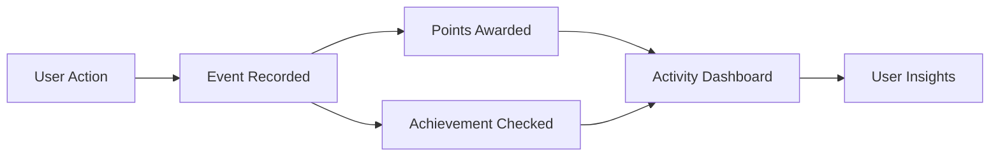

# Features

This document provides a detailed breakdown of all features in the Nandi Mindfulness App.

## Core AI Features

### 1. AI Companion

**Description:** Conversational interface that guides users to appropriate features using intelligent intent detection.

**Key Capabilities:**
- Intent detection with 20+ intent types
- Feature mapping and routing
- Context-aware responses
- Personalized guidance
- Multi-turn conversations

**Technical Implementation:**
- OpenAI/Claude integration
- Intent classification system
- Feature routing logic
- Conversation state management

**User Flow:**
1. User asks a question or expresses intent
2. System detects intent type
3. Routes to appropriate feature or provides guidance
4. Maintains conversation context

### 2. Ask Nandi

**Description:** Philosophical inquiry and dialogue with AI for spiritual guidance and reflection.

**Key Capabilities:**
- Philosophical conversations
- Reflective summaries
- Conversation bookmarks
- Mood tagging
- Journal integration

**Technical Implementation:**
- AI conversation service
- Reflection generation
- Bookmark system
- Mood tracking integration

**Data Model:**
- `AskNandiConversation` - Main conversation records
- `AskNandiReflection` - User reflections on conversations
- Mood logs and intention tags

### 3. Moral Play

**Description:** Vikram-Vetal moral dilemma engine with interactive stories and decision-making.

**Key Capabilities:**
- Moral story presentation
- Interactive questions
- Response tracking
- Progress monitoring
- Score calculation

**Technical Implementation:**
- Story generation (AI + golden source)
- Question system
- Response validation
- Progress tracking

**Data Model:**
- `MoralStory` - Story records
- `MoralStoryQuestion` - Questions for each story
- `MoralStoryResponse` - User responses

### 4. Silent Journal

**Description:** Guided journaling with reflection, mood logs, and intention tags.

**Key Capabilities:**
- Journal entry creation
- Timed journaling sessions
- Mood logging (before/after)
- Intention tagging
- AI-generated reflections
- Bookmark system

**Technical Implementation:**
- Journal entry service
- Mood tracking integration
- Intention tag system
- AI reflection generation
- Bookmark management

**Data Model:**
- `SilentJournalEntry` - Journal entries
- `SilentJournalReflection` - AI-generated reflections
- `SilentJournalMoodLog` - Mood logs
- `SilentJournalIntentionTag` - Intention tags
- `SilentJournalBookmark` - Bookmarks

## Wellness Features

### 5. Insights/Quizzes

**Description:** Mindfulness assessments and insights through interactive quizzes.

**Key Capabilities:**
- Quiz presentation
- Question answering
- Score calculation
- Results display
- Activity tracking

**Technical Implementation:**
- Quiz service
- Question management
- Response processing
- Score calculation
- Results analytics

**Data Model:**
- `Quiz` - Quiz records
- `QuizQuestion` - Questions
- `QuizResponse` - User responses

### 6. Core Calm

**Description:** Meditation and breathwork sessions for mindfulness practice.

**Key Capabilities:**
- Meditation session playback
- Breathwork exercises
- Session tracking
- Progress monitoring

**Technical Implementation:**
- Audio/video playback
- Session management
- Progress tracking
- Activity logging

### 7. Activity Sessions

**Description:** Multiple session types including meditation, journal, lifebuilder, and sync sessions.

**Key Capabilities:**
- Multiple session types
- Session orchestration
- Progress tracking
- Completion tracking
- Activity logging

**Technical Implementation:**
- Session orchestrator
- Multi-type session support
- Progress tracking
- Event generation

**Session Types:**
- Meditation sessions
- Journal sessions
- Lifebuilder sessions
- Sync sessions

### 8. Activity Dashboard

**Description:** Comprehensive user activity tracking and analytics dashboard.

**Key Capabilities:**
- Recent activity display
- Path balance visualization
- Points distribution charts
- Achievement showcase
- Activity statistics

**Technical Implementation:**
- Activity query service
- Analytics aggregation
- Data visualization
- Real-time updates

**Metrics Displayed:**
- Recent activities
- Yoga path balance
- Points by category
- Achievement progress
- Activity trends

### 9. Journey

**Description:** Personal growth and progress tracking with summary and milestones.

**Key Capabilities:**
- Progress summary
- Milestone tracking
- Growth visualization
- Achievement highlights
- Personal insights

**Technical Implementation:**
- Journey service
- Progress calculation
- Milestone detection
- Insight generation

## User Features

### 10. Profile

**Description:** Comprehensive account management with security features.

**Key Capabilities:**
- Profile information management
- Password management
- Security questions
- Progressive registration support
- Account settings

**Technical Implementation:**
- Profile service
- Password hashing
- Security question system
- Progressive registration flow

**Security Features:**
- Password strength validation
- Security question recovery
- Account verification
- Session management

### 11. Favorites

**Description:** Save and manage favorite content across the platform.

**Key Capabilities:**
- Favorite content saving
- Favorite management
- Quick access to favorites
- Favorite categories

**Technical Implementation:**
- Favorite service
- Content reference system
- Favorite organization

**Data Model:**
- `UserFavorite` - Favorite records with type and reference

### 12. Feedback

**Description:** User feedback system for feature improvement and bug reporting.

**Key Capabilities:**
- Feedback submission
- Feedback categorization
- Priority assignment
- Status tracking
- Admin review

**Technical Implementation:**
- Feedback service
- Categorization system
- Priority management
- Admin review workflow

**Data Model:**
- `UserFeedback` - Feedback records with type, priority, status

### 13. Beta Testing

**Description:** Invite-based beta testing system with feedback management.

**Key Capabilities:**
- Invite code system
- Beta user management
- Feedback collection
- Phase tracking
- Activity monitoring

**Technical Implementation:**
- Invite code generation
- Beta user tracking
- Feedback aggregation
- Phase management

**Data Model:**
- `InviteCode` - Invite codes
- `InviteCodeUsage` - Usage tracking
- `BetaFeedback` - Beta-specific feedback

## Admin Features

### 14. Admin Dashboard

**Description:** Centralized admin dashboard with analytics and management tools.

**Key Capabilities:**
- System overview
- User analytics
- Content management
- Quick actions
- Statistics display

**Technical Implementation:**
- Dashboard service
- Analytics aggregation
- Real-time updates
- Admin authentication

### 15. Achievement Management

**Description:** Create and manage achievements with criteria builder.

**Key Capabilities:**
- Achievement creation
- Criteria builder
- Achievement editing
- Achievement activation/deactivation
- Achievement analytics

**Technical Implementation:**
- Achievement service
- Criteria evaluation system
- Achievement wizard
- Analytics integration

**Achievement Types:**
- Event count achievements
- Cumulative time achievements
- Streak achievements
- Milestone achievements
- Progress achievements
- Composite achievements

**Data Model:**
- `Achievement` - Achievement definitions
- `UserAchievement` - User achievement records

### 16. Points System

**Description:** Points distribution and management system.

**Key Capabilities:**
- Points distribution view
- Points by category
- Points history
- Points analytics
- Points rules management

**Technical Implementation:**
- Points processor
- Points distribution service
- Points analytics
- Rule configuration

**Data Model:**
- `PointsHistory` - Points transaction records
- Points linked to events

### 17. Beta Management

**Description:** Comprehensive beta testing management system.

**Key Capabilities:**
- Invite code management
- Beta user management
- Feedback review
- Phase management
- Analytics

**Technical Implementation:**
- Beta service
- Invite code service
- Feedback review workflow
- Analytics service

### 18. User Management

**Description:** User CRUD operations, role management, and analytics.

**Key Capabilities:**
- User listing and search
- User details view
- Role management
- User analytics
- User activity tracking

**Technical Implementation:**
- User service
- Role management
- Analytics aggregation
- Activity tracking

### 19. Geographic Analytics

**Description:** Privacy-first user distribution insights.

**Key Capabilities:**
- Geographic distribution
- Privacy-compliant analytics
- Regional insights
- User distribution maps

**Technical Implementation:**
- Geographic analytics service
- Privacy filtering
- Data aggregation
- Visualization

### 20. AI Content Generation

**Description:** Generate quizzes and moral stories using OpenAI prompts and populate database.

**Key Capabilities:**
- Quiz generation from prompts
- Story generation from prompts
- Golden source loading
- Batch generation
- Content validation
- Database population

**Technical Implementation:**
- Quiz generator service
- Story generator service
- OpenAI integration
- Content validation
- Database persistence

**Workflow:**
1. Admin provides prompt or selects golden source
2. AI service generates content
3. Content validated and parsed
4. Content persisted to database
5. Generation history tracked

**Data Model:**
- Generated `Quiz` and `QuizQuestion` records
- Generated `MoralStory` and `MoralStoryQuestion` records

## Additional Features

### 21. Home

**Description:** Personalized home dashboard with quick access to features.

**Key Capabilities:**
- Personalized content
- Quick actions
- Recent activity
- Feature shortcuts
- Personalized recommendations

### 22. Create Menu

**Description:** Quick access to activity creation.

**Key Capabilities:**
- Activity type selection
- Quick creation flow
- Session builder
- Activity configuration

### 23. Games

**Description:** Game sessions and management.

**Key Capabilities:**
- Game session creation
- Game play tracking
- Score tracking
- Game analytics

**Data Model:**
- `Game` - Game definitions
- `GameSession` - Game session records

### 24. Mood Logs

**Description:** Mood tracking and analytics.

**Key Capabilities:**
- Mood logging
- Mood intensity tracking
- Mood history
- Mood analytics
- Mood patterns

**Data Model:**
- `MoodLog` - Mood log records
- Linked to reflections and journal entries

### 25. Agent Insights

**Description:** AI-generated insights based on user activity.

**Key Capabilities:**
- Insight generation
- Insight categorization
- Insight scoring
- Insight display

**Data Model:**
- `AgentInsight` - Insight records with type, content, score

### 26. Events

**Description:** Event tracking and logging system.

**Key Capabilities:**
- Event recording
- Event querying
- Event analytics
- Event filtering

**Data Model:**
- `UserEvent` - Event records with action, objectType, metadata

## Feature Integration

### Cross-Feature Integration

Many features integrate with each other:

- **Events → Points → Achievements**: User actions trigger events, which award points and evaluate achievements
- **Journal → Mood Logs**: Journal entries can include mood logs
- **Ask Nandi → Reflections**: Conversations can generate reflections
- **Activity Dashboard → All Features**: Aggregates data from all features
- **Admin Content Generation → Quizzes/Stories**: Generates content for user features

### Event-Driven Integration

The event-driven system connects all features:

## Feature Status

All features listed above are **implemented and production-ready** in the beta version of the application.

## Future Enhancements

Potential future features:
- Social features (sharing, community)
- Advanced analytics
- Custom content creation
- Integration with external services
- Mobile app versions
