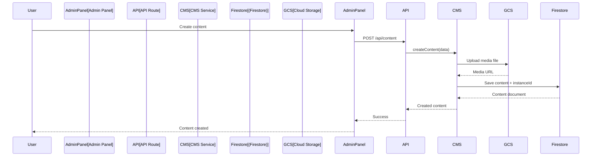
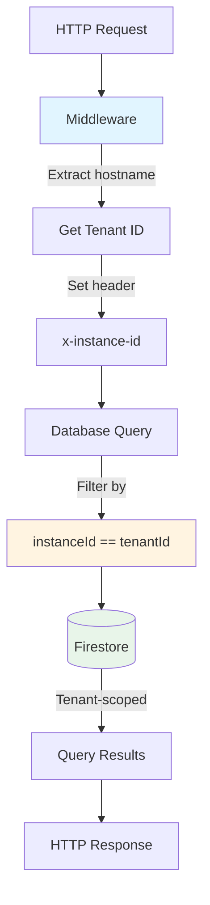
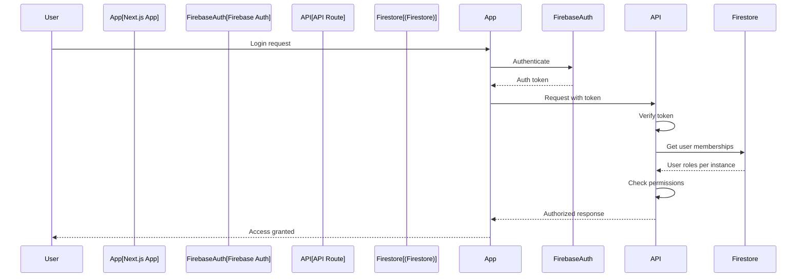
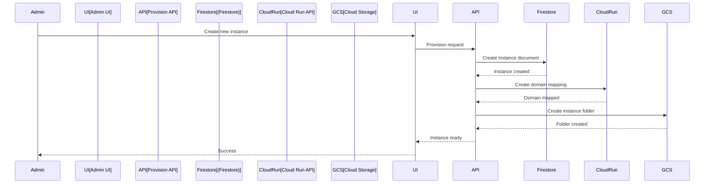

# Data Flow Diagrams

## Content Management Flow

```mermaid
sequenceDiagram
    participant User
    participant AdminPanel[Admin Panel]
    participant API[API Route]
    participant CMS[CMS Service]
    participant Firestore[(Firestore)]
    participant GCS[Cloud Storage]
    
    User->>AdminPanel: Create content
    AdminPanel->>API: POST /api/content
    API->>CMS: createContent(data)
    CMS->>GCS: Upload media file
    GCS-->>CMS: Media URL
    CMS->>Firestore: Save content + instanceId
    Firestore-->>CMS: Content document
    CMS-->>API: Created content
    API-->>AdminPanel: Success
    AdminPanel-->>User: Content created
```

## Multi-Tenant Query Flow

```mermaid
graph TB
    Request[HTTP Request] --> Middleware[Middleware]
    Middleware -->|Extract hostname| TenantID[Get Tenant ID]
    TenantID -->|Set header| Header[x-instance-id]
    Header --> Query[Database Query]
    Query -->|Filter by| Filter[instanceId == tenantId]
    Filter --> Firestore[(Firestore)]
    Firestore -->|Tenant-scoped| Results[Query Results]
    Results --> Response[HTTP Response]
    
    style Middleware fill:#e1f5ff
    style Filter fill:#fff4e1
    style Firestore fill:#e8f5e9
```

## Authentication Flow

```mermaid
sequenceDiagram
    participant User
    participant App[Next.js App]
    participant FirebaseAuth[Firebase Auth]
    participant API[API Route]
    participant Firestore[(Firestore)]
    
    User->>App: Login request
    App->>FirebaseAuth: Authenticate
    FirebaseAuth-->>App: Auth token
    App->>API: Request with token
    API->>API: Verify token
    API->>Firestore: Get user memberships
    Firestore-->>API: User roles per instance
    API->>API: Check permissions
    API-->>App: Authorized response
    App-->>User: Access granted
```

## Instance Provisioning Flow

```mermaid
sequenceDiagram
    participant Admin
    participant UI[Admin UI]
    participant API[Provision API]
    participant Firestore[(Firestore)]
    participant CloudRun[Cloud Run API]
    participant GCS[Cloud Storage]
    
    Admin->>UI: Create new instance
    UI->>API: Provision request
    API->>Firestore: Create instance document
    Firestore-->>API: Instance created
    API->>CloudRun: Create domain mapping
    CloudRun-->>API: Domain mapped
    API->>GCS: Create instance folder
    GCS-->>API: Folder created
    API-->>UI: Instance ready
    UI-->>Admin: Success
```
