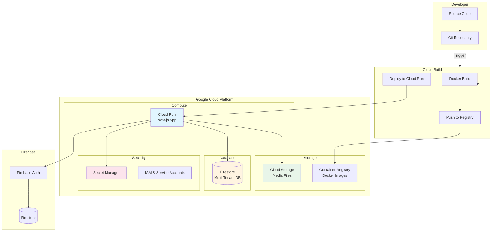
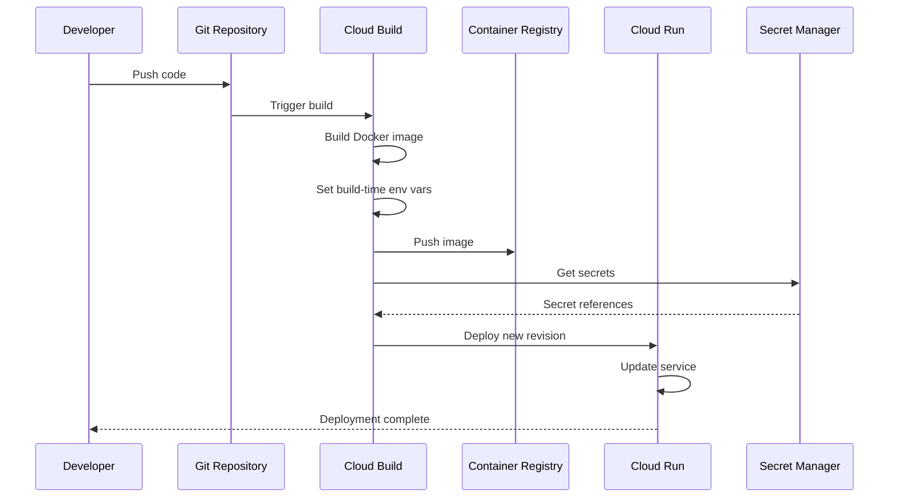
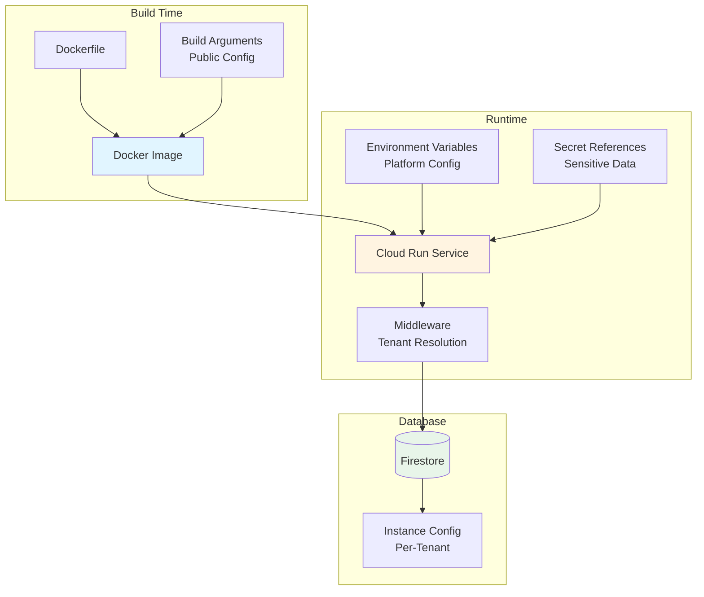

# Infrastructure Architecture Diagram

## GCP Infrastructure

```mermaid
graph TB
    subgraph Dev[Developer]
        Code[Source Code]
        Git[Git Repository]
    end
    
    subgraph CloudBuild[Cloud Build]
        Build[Docker Build]
        Push[Push to Registry]
        Deploy[Deploy to Cloud Run]
    end
    
    subgraph GCP[Google Cloud Platform]
        subgraph Compute[Compute]
            CloudRun[Cloud Run<br/>Next.js App]
        end
        
        subgraph Storage[Storage]
            GCS[Cloud Storage<br/>Media Files]
            Registry[Container Registry<br/>Docker Images]
        end
        
        subgraph Database[Database]
            Firestore[(Firestore<br/>Multi-Tenant DB)]
        end
        
        subgraph Security[Security]
            SecretMgr[Secret Manager]
            IAM[IAM & Service Accounts]
        end
    end
    
    subgraph Firebase[Firebase]
        Auth[Firebase Auth]
        FirestoreDB[(Firestore)]
    end
    
    Code --> Git
    Git -->|Trigger| CloudBuild
    CloudBuild --> Build
    Build --> Push
    Push --> Registry
    Deploy --> CloudRun
    CloudRun --> Firestore
    CloudRun --> GCS
    CloudRun --> SecretMgr
    CloudRun --> Auth
    Auth --> FirestoreDB
    
    style CloudRun fill:#e1f5ff
    style Firestore fill:#fff4e1
    style GCS fill:#e8f5e9
    style SecretMgr fill:#fce4ec
```

## CI/CD Pipeline Flow

```mermaid
sequenceDiagram
    participant Dev as Developer
    participant Git as Git Repository
    participant Build as Cloud Build
    participant Registry as Container Registry
    participant CloudRun as Cloud Run
    participant SecretMgr as Secret Manager
    
    Dev->>Git: Push code
    Git->>Build: Trigger build
    Build->>Build: Build Docker image
    Build->>Build: Set build-time env vars
    Build->>Registry: Push image
    Build->>SecretMgr: Get secrets
    SecretMgr-->>Build: Secret references
    Build->>CloudRun: Deploy new revision
    CloudRun->>CloudRun: Update service
    CloudRun-->>Dev: Deployment complete
```

## Deployment Architecture

```mermaid
graph TB
    subgraph Build[Build Time]
        Dockerfile[Dockerfile]
        BuildArgs[Build Arguments<br/>Public Config]
        Image[Docker Image]
    end
    
    subgraph Runtime[Runtime]
        CloudRun[Cloud Run Service]
        EnvVars[Environment Variables<br/>Platform Config]
        Secrets[Secret References<br/>Sensitive Data]
        Middleware[Middleware<br/>Tenant Resolution]
    end
    
    subgraph Database[Database]
        Firestore[(Firestore)]
        InstanceConfig[Instance Config<br/>Per-Tenant]
    end
    
    Dockerfile --> Image
    BuildArgs --> Image
    Image --> CloudRun
    EnvVars --> CloudRun
    Secrets --> CloudRun
    CloudRun --> Middleware
    Middleware --> Firestore
    Firestore --> InstanceConfig
    
    style Image fill:#e1f5ff
    style CloudRun fill:#fff4e1
    style Firestore fill:#e8f5e9
```
