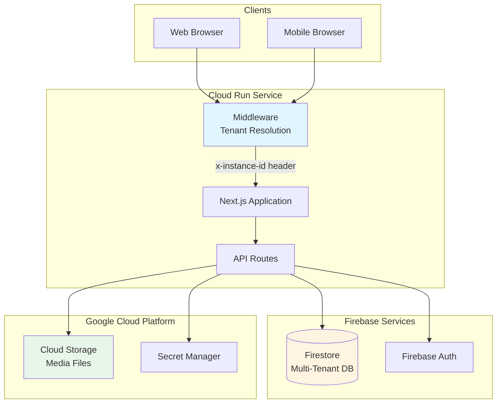
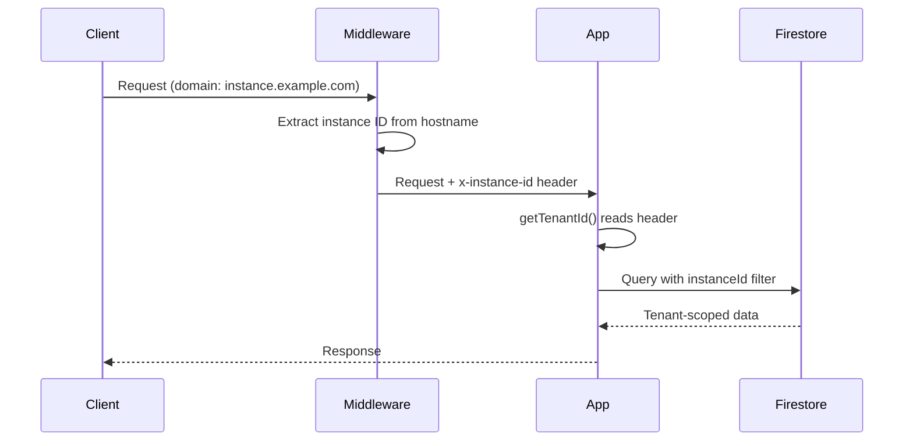
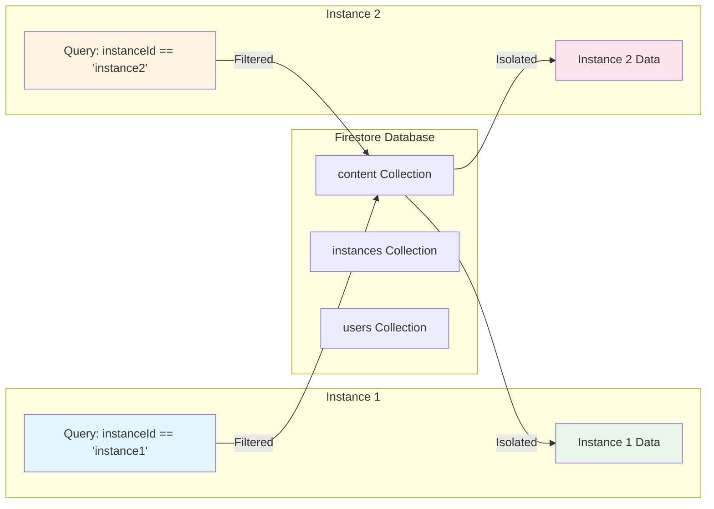

# Multi-Tenant Architecture Diagram

## System Overview

```mermaid
graph TB
    subgraph Clients[Clients]
        Web[Web Browser]
        Mobile[Mobile Browser]
    end
    
    subgraph CloudRun[Cloud Run Service]
        Middleware[Middleware<br/>Tenant Resolution]
        App[Next.js Application]
        API[API Routes]
    end
    
    subgraph Firebase[Firebase Services]
        Firestore[(Firestore<br/>Multi-Tenant DB)]
        Auth[Firebase Auth]
    end
    
    subgraph GCP[Google Cloud Platform]
        GCS[Cloud Storage<br/>Media Files]
        SecretMgr[Secret Manager]
    end
    
    Web --> Middleware
    Mobile --> Middleware
    Middleware -->|x-instance-id header| App
    App --> API
    API --> Firestore
    API --> Auth
    API --> GCS
    API --> SecretMgr
    
    style Middleware fill:#e1f5ff
    style Firestore fill:#fff4e1
    style GCS fill:#e8f5e9
```

## Tenant Resolution Flow

```mermaid
sequenceDiagram
    participant Client
    participant Middleware
    participant App
    participant Firestore
    
    Client->>Middleware: Request (domain: instance.example.com)
    Middleware->>Middleware: Extract instance ID from hostname
    Middleware->>App: Request + x-instance-id header
    App->>App: getTenantId() reads header
    App->>Firestore: Query with instanceId filter
    Firestore-->>App: Tenant-scoped data
    App-->>Client: Response
```

## Data Isolation Pattern

```mermaid
graph LR
    subgraph Firestore[Firestore Database]
        Content[content Collection]
        Instances[instances Collection]
        Users[users Collection]
    end
    
    subgraph Tenant1[Instance 1]
        Query1[Query: instanceId == 'instance1']
        Data1[Instance 1 Data]
    end
    
    subgraph Tenant2[Instance 2]
        Query2[Query: instanceId == 'instance2']
        Data2[Instance 2 Data]
    end
    
    Query1 -->|Filtered| Content
    Query2 -->|Filtered| Content
    Content -->|Isolated| Data1
    Content -->|Isolated| Data2
    
    style Query1 fill:#e1f5ff
    style Query2 fill:#fff4e1
    style Data1 fill:#e8f5e9
    style Data2 fill:#fce4ec
```
