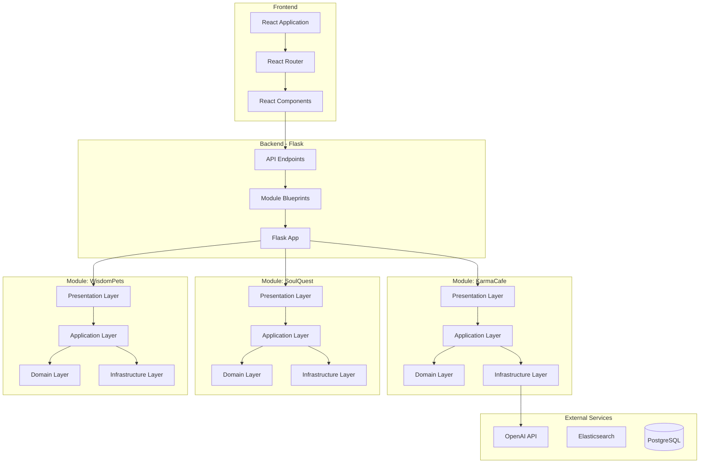
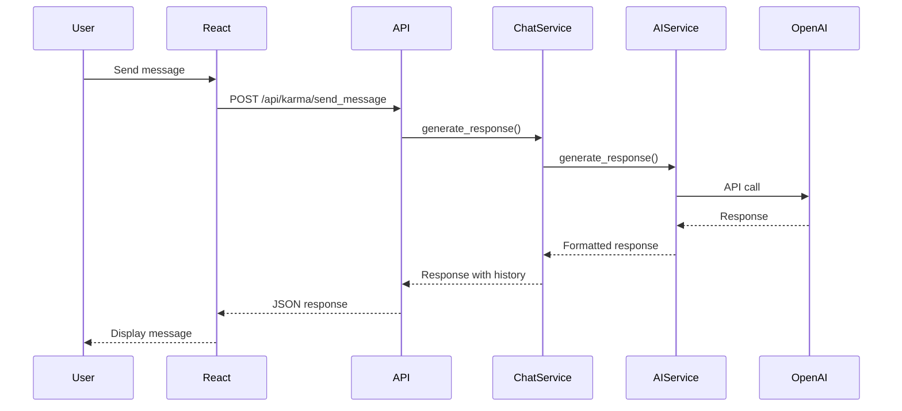
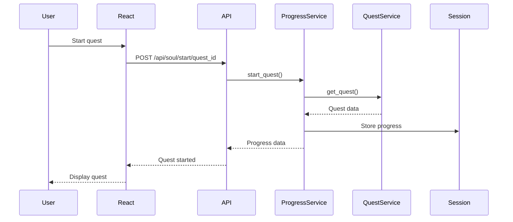

# Nandi Platform Architecture

This document describes the architecture of the Nandi Spiritual Platform, built using Domain-Driven Design principles.

## System Overview

The Nandi platform is a multi-module application that provides a unified interface for three distinct spiritual modules. The platform uses Domain-Driven Design (DDD) to organize code around business domains, ensuring clear separation of concerns and maintainability.

## Architecture Principles

1. **Domain-Driven Design**: Code organized around business domains
2. **Layered Architecture**: Clear separation between domain, application, infrastructure, and presentation
3. **Modular Design**: Each module is self-contained with clear boundaries
4. **Separation of Concerns**: Business logic separated from technical concerns
5. **Testability**: Architecture supports unit and integration testing

## System Architecture

### High-Level Architecture



## Domain-Driven Design Structure

Each module follows a consistent DDD structure:

```
module_name/
├── domain/                 # Core business logic
│   ├── entities/           # Domain entities
│   └── services/           # Domain services
├── application/            # Application services
│   └── services/           # Use case orchestration
├── infrastructure/         # Technical concerns
│   ├── external/           # External service integration
│   └── repositories/       # Data access
├── presentation/           # API endpoints
│   └── routes.py           # Flask routes
└── config.py               # Module configuration
```

### Layer Responsibilities

#### Domain Layer
- **Purpose**: Core business logic and entities
- **Independence**: No dependencies on frameworks or external services
- **Entities**: Business objects (Avatar, Quest, Companion)
- **Services**: Business rules and domain logic

#### Application Layer
- **Purpose**: Orchestrates use cases
- **Responsibilities**: Coordinates between domain and infrastructure
- **Services**: ChatService, ProgressService, InteractionService
- **No Business Rules**: Contains orchestration, not business logic

#### Infrastructure Layer
- **Purpose**: Technical capabilities and external integrations
- **Responsibilities**: 
  - External API integration (OpenAI)
  - Session management
  - Data persistence (if needed)
- **Abstractions**: Implements interfaces defined in domain/application

#### Presentation Layer
- **Purpose**: User interface and API endpoints
- **Responsibilities**:
  - HTTP request/response handling
  - Route definitions
  - Input validation
  - Response formatting

## Module Architecture

### KarmaCafe Module

**Purpose**: AI-powered conversational chatbot for Vedic philosophical concepts

**Architecture Flow:**


**Key Components:**
- **Domain**: Avatar entities, AvatarService
- **Application**: ChatService (orchestrates conversations)
- **Infrastructure**: AIService (OpenAI integration)
- **Presentation**: Routes for chat endpoints

### SoulQuest Module

**Purpose**: Interactive spiritual adventure game with quests

**Architecture Flow:**


**Key Components:**
- **Domain**: Quest entities, QuestService
- **Application**: ProgressService (manages quest progress)
- **Infrastructure**: SessionService (Flask session)
- **Presentation**: Routes for quest endpoints

### WisdomPets Module

**Purpose**: Virtual spiritual animal companions

**Key Components:**
- **Domain**: Companion entities, CompanionService
- **Application**: InteractionService (manages interactions)
- **Infrastructure**: SessionService (Flask session)
- **Presentation**: Routes for pet endpoints

## Flask + React Integration

### Development Mode

```
React Dev Server (port 3000)
    ↓ (proxies API calls)
Flask Backend (port 5050)
    ↓ (serves API)
Modules
```

### Production Mode

```
Flask App (port 5050)
    ├── Serves React build (static files)
    └── API endpoints (/api/*)
```

## API Structure

All API endpoints are prefixed with `/api`:

- `/api/karma/*` - KarmaCafe endpoints
- `/api/soul/*` - SoulQuest endpoints
- `/api/pets/*` - WisdomPets endpoints
- `/api/modules` - Module information

## Session Management

The platform uses Flask-Session for session management:
- Conversation history stored in session
- Quest progress stored in session
- Pet interactions stored in session
- Session-based user state

## Testing Architecture

### Unit Tests
- Domain layer: Test business logic in isolation
- Application layer: Test use case orchestration
- Infrastructure: Mock external services

### Integration Tests
- API endpoints: Test full request/response cycle
- Module integration: Test module interactions

### E2E Tests
- Selenium-based browser tests
- Full user workflows
- Cross-module testing

## Benefits of DDD Architecture

1. **Modularity**: Each module is self-contained
2. **Testability**: Clear boundaries enable isolated testing
3. **Maintainability**: Changes isolated to specific layers
4. **Scalability**: Easy to add new modules
5. **Clarity**: Business logic clearly separated from technical concerns

## Configuration Management

The platform uses environment-based configuration:
- `environments/.env.dev` - Development
- `environments/.env.test` - Testing
- `environments/.env.prod` - Production

Configuration includes:
- Database URLs
- OpenAI API keys
- Elasticsearch URLs
- Secret keys
- Port settings

## Conclusion

The Nandi platform demonstrates a clean, maintainable architecture using Domain-Driven Design principles. The layered structure ensures separation of concerns, making the codebase easy to understand, test, and extend.
