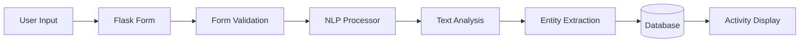

# Personal Activity Tracker

An NLP-powered web application for tracking and analyzing personal activities including stock trades, fitness, spending, mood, and more.

## Overview

The Personal Activity Tracker is a comprehensive Flask application that allows users to log various activities and automatically extract insights using Natural Language Processing (NLP). The application uses NLTK and spaCy to analyze journal entries, categorize activities, detect sentiment, and extract entities.

## Project Status

**Status:** Prototype

**Development Period:** March 2025

## Key Features

### Core Functionality

- **Multi-User Support**: User authentication and activity isolation
- **Activity Logging**: Free-form journal entries for various activities
- **Automatic Categorization**: NLP-powered activity categorization
- **Sentiment Analysis**: Detects mood and sentiment from entries
- **Entity Extraction**: Identifies people, places, and other entities
- **Metrics Extraction**: Extracts numerical values (distance, money, etc.)
- **Customized Reporting**: Analytics and insights based on activities
- **Privacy-Focused**: User data isolation and security

### NLP Features

- **Topic Detection**: Identifies topics from journal entries
- **Activity Detection**: Recognizes specific activities mentioned
- **Sentiment Scoring**: Provides sentiment scores (-1 to 1)
- **Mood Detection**: Categorizes mood from text
- **Named Entity Recognition**: Extracts people, places, organizations
- **Metric Extraction**: Finds numerical values and units

## Technology Stack

### Backend
- **Framework**: Flask
- **ORM**: SQLAlchemy
- **Database**: SQLite/PostgreSQL
- **Authentication**: Flask-Login
- **Migrations**: Flask-Migrate

### NLP Libraries
- **NLTK**: Natural Language Toolkit for text processing
- **spaCy**: Advanced NLP library for entity recognition
- **scikit-learn**: Machine learning for categorization
- **pandas**: Data manipulation and analysis
- **numpy**: Numerical computations

### Frontend
- **Templates**: Jinja2 templates
- **Forms**: Flask-WTF
- **Styling**: CSS

## Architecture

### Application Structure

```
personal_tracker/
├── app.py                 # Main Flask application
├── models.py              # SQLAlchemy models
├── forms.py               # WTForms definitions
├── nlp_processor.py       # NLP processing logic
├── extensions.py          # Flask extensions
├── migrations/            # Database migrations
├── templates/             # Jinja2 templates
├── static/                # CSS, JS, images
└── requirements.txt       # Dependencies
```

### Data Flow



### NLP Processing Pipeline

1. **Text Input**: User submits journal entry
2. **Preprocessing**: Text cleaning and normalization
3. **Sentiment Analysis**: NLTK-based sentiment scoring
4. **Entity Recognition**: spaCy NER for people, places, etc.
5. **Topic Detection**: scikit-learn for topic categorization
6. **Activity Detection**: Pattern matching for activity types
7. **Metric Extraction**: Regex and NLP for numerical values
8. **Storage**: Save entry with extracted metadata

## Database Models

### User Model
- User authentication
- Password hashing
- API token generation
- Activity relationships

### Activity Model
- Journal entry content
- AI-extracted metadata:
  - Sentiment score
  - Mood
  - Topics
  - Entities
  - Activities
  - Metrics
- Timestamp tracking

## API Features

### RESTful Endpoints
- User registration and login
- Activity CRUD operations
- Analytics endpoints
- Reporting endpoints

### API Token Authentication
- Token-based authentication
- Secure API access
- User-specific data access

## NLP Processing Details

### Sentiment Analysis
- Uses NLTK's VADER sentiment analyzer
- Provides scores from -1 (negative) to 1 (positive)
- Context-aware sentiment detection

### Entity Recognition
- spaCy's named entity recognition
- Identifies:
  - Persons
  - Organizations
  - Locations
  - Dates
  - Money amounts

### Activity Categorization
- Pattern-based activity detection
- Categories include:
  - Stock trades
  - Fitness activities
  - Spending
  - Mood tracking
  - General activities

### Metric Extraction
- Numerical value extraction
- Unit recognition (miles, dollars, etc.)
- Context-aware metric parsing

## Project Statistics

| Metric | Value |
|--------|-------|
| **Python Files** | 10+ |
| **NLP Libraries** | 5+ (NLTK, spaCy, scikit-learn, pandas, numpy) |
| **Database Models** | 2 (User, Activity) |
| **API Endpoints** | 10+ |

## Code Samples

See the [code-samples](./code-samples/) directory for examples of:
- NLP processing pipeline
- SQLAlchemy models
- Flask forms and validation
- Activity categorization logic

## Case Studies

- [NLP-Powered Activity Tracking](./case-studies/nlp-activity-tracking.md)

---

**Note:** This is a showcase repository. The actual production codebase remains private.
