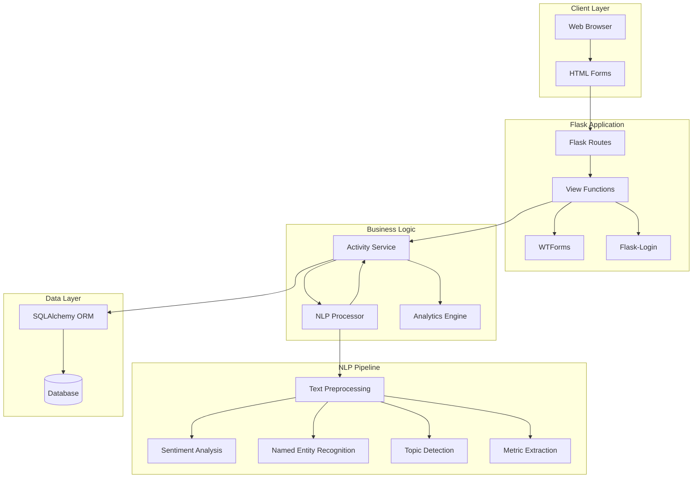
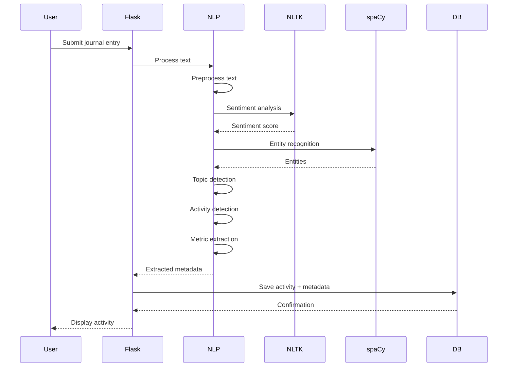

# Personal Activity Tracker Architecture

This document describes the architecture of the Personal Activity Tracker, focusing on its NLP processing pipeline and Flask application structure.

## System Overview

The Personal Activity Tracker is a Flask web application that combines traditional web development with advanced Natural Language Processing to automatically extract insights from user journal entries.

## Architecture Diagram



## Application Structure

### Flask Application Setup

```python
# app.py structure
from flask import Flask
from extensions import db, login_manager
from models import User, Activity

app = Flask(__name__)
app.config['SECRET_KEY'] = 'your-secret-key'
app.config['SQLALCHEMY_DATABASE_URI'] = 'sqlite:///tracker.db'

db.init_app(app)
login_manager.init_app(app)
```

### Model Architecture

#### User Model
- Authentication and authorization
- Password hashing with Werkzeug
- API token generation
- Relationship to activities

#### Activity Model
- Journal entry content (text)
- AI-extracted metadata fields:
  - `sentiment`: Float (-1 to 1)
  - `mood`: String (detected mood)
  - `topics`: JSON (list of topics)
  - `entities`: JSON (named entities)
  - `activities`: JSON (detected activities)
  - `metrics`: JSON (extracted numerical values)
- Timestamp tracking

## NLP Processing Pipeline

### Pipeline Stages



### 1. Text Preprocessing

- Text cleaning
- Normalization
- Tokenization
- Stop word removal (optional)

### 2. Sentiment Analysis

**Library**: NLTK VADER Sentiment Analyzer

- Analyzes text for emotional tone
- Returns compound score (-1 to 1)
- Context-aware sentiment detection
- Handles negations and intensifiers

### 3. Named Entity Recognition

**Library**: spaCy

- Identifies named entities:
  - Persons
  - Organizations
  - Locations (GPE)
  - Dates
  - Money amounts
- Returns structured entity data

### 4. Topic Detection

**Library**: scikit-learn

- Categorizes text into topics
- Uses TF-IDF vectorization
- Classification or clustering
- Returns topic labels

### 5. Activity Detection

- Pattern-based matching
- Recognizes activity keywords
- Categories:
  - Stock trades
  - Fitness activities
  - Spending
  - Mood tracking
- Returns activity types

### 6. Metric Extraction

- Regex patterns for numbers
- Unit recognition (miles, dollars, etc.)
- Context-aware extraction
- Returns structured metrics

## Data Flow

### Activity Creation Flow

1. **User Input**: User submits journal entry via form
2. **Form Validation**: WTForms validates input
3. **NLP Processing**: Text sent to NLP processor
4. **Metadata Extraction**: All NLP stages execute
5. **Database Storage**: Activity saved with metadata
6. **Response**: User sees activity with insights

### Analytics Flow

1. **Query Activities**: Fetch user's activities
2. **Aggregate Data**: Group by categories, time periods
3. **Calculate Metrics**: Sentiment trends, activity counts
4. **Generate Reports**: Visualizations and insights
5. **Display**: Present analytics to user

## Security Architecture

### Authentication

- **Flask-Login**: Session-based authentication
- **Password Hashing**: Werkzeug security
- **API Tokens**: Token-based API access
- **User Isolation**: Data scoped to users

### Data Privacy

- User-specific data access
- Secure password storage
- API token security
- Input validation and sanitization

## Database Schema

### User Table
- `id`: Primary key
- `email`: Unique email address
- `password_hash`: Hashed password
- `api_token`: API access token

### Activity Table
- `id`: Primary key
- `user_id`: Foreign key to User
- `content`: Journal entry text
- `sentiment`: Sentiment score
- `mood`: Detected mood
- `topics`: JSON array
- `entities`: JSON object
- `activities`: JSON array
- `metrics`: JSON object
- `timestamp`: Creation time

## API Architecture

### RESTful Endpoints

- `POST /register` - User registration
- `POST /login` - User login
- `GET /activities` - List user activities
- `POST /activities` - Create activity
- `GET /activities/<id>` - Get activity
- `PUT /activities/<id>` - Update activity
- `DELETE /activities/<id>` - Delete activity
- `GET /analytics` - Get analytics

### API Authentication

- Token-based authentication
- Header: `Authorization: Bearer <token>`
- User-specific data access

## Error Handling

- Form validation errors
- NLP processing errors
- Database errors
- Authentication errors
- User-friendly error messages

## Testing Strategy

### Unit Tests
- NLP processing functions
- Model methods
- Utility functions

### Integration Tests
- API endpoints
- Database operations
- Authentication flows

### NLP Tests
- Sentiment analysis accuracy
- Entity recognition accuracy
- Topic detection accuracy

## Performance Considerations

- **NLP Processing**: Can be CPU-intensive
- **Caching**: Cache NLP models
- **Async Processing**: Consider background jobs for NLP
- **Database Indexing**: Index user_id, timestamp

## Future Enhancements

- Background job processing for NLP
- Machine learning model training
- Advanced analytics and visualizations
- Export functionality
- Mobile app API
