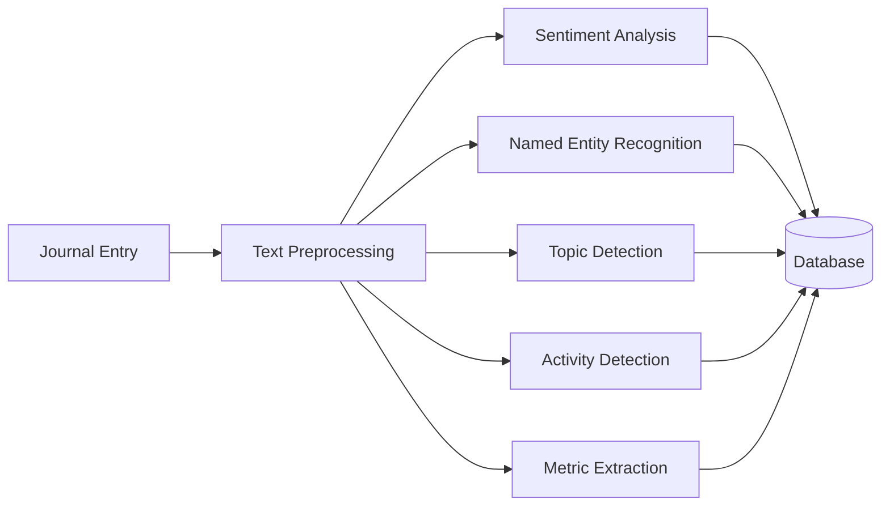

# Case Study: NLP-Powered Activity Tracking

## Problem

Users needed to track various activities (stock trades, fitness, spending, mood) but:
- Manual categorization was time-consuming
- Users forgot to categorize entries
- Inconsistent categorization across entries
- No automatic insights from journal entries

The application needed to automatically:
- Categorize activities
- Detect sentiment and mood
- Extract entities (people, places)
- Identify topics
- Extract numerical metrics

## Solution

Implemented a comprehensive **NLP processing pipeline** using NLTK and spaCy.

### NLP Pipeline Architecture



### Implementation Components

#### 1. Sentiment Analysis (NLTK VADER)

**Purpose**: Detect emotional tone and mood

**Implementation**:
```python
from nltk.sentiment import SentimentIntensityAnalyzer

sia = SentimentIntensityAnalyzer()
sentiment_scores = sia.polarity_scores(text)
sentiment = sentiment_scores['compound']  # -1 to 1
```

**Mood Mapping**:
- Very Negative: -1.0 to -0.5
- Negative: -0.5 to -0.1
- Neutral: -0.1 to 0.1
- Positive: 0.1 to 0.5
- Very Positive: 0.5 to 1.0

#### 2. Named Entity Recognition (spaCy)

**Purpose**: Extract people, places, organizations

**Implementation**:
```python
import spacy

nlp = spacy.load("en_core_web_sm")
doc = nlp(text)
entities = {
    'persons': [ent.text for ent in doc.ents if ent.label_ == 'PERSON'],
    'locations': [ent.text for ent in doc.ents if ent.label_ == 'GPE'],
    'organizations': [ent.text for ent in doc.ents if ent.label_ == 'ORG']
}
```

#### 3. Topic Detection (NLTK + scikit-learn)

**Purpose**: Identify main topics from text

**Implementation**:
```python
from nltk import FreqDist
from sklearn.feature_extraction.text import TfidfVectorizer

# Remove stopwords
words = [w for w in words if w not in stop_words]
freq_dist = FreqDist(words)
topics = [word for word, freq in freq_dist.most_common(5)]
```

#### 4. Activity Detection (Pattern Matching)

**Purpose**: Categorize activities based on keywords

**Implementation**:
```python
activity_patterns = {
    'exercise': r'(ran|run|walk|gym|workout|exercise|yoga)',
    'work': r'(meeting|work|project|study|read|write|code)',
    'social': r'(met|meet|talk|chat|party|dinner|friend)',
    # ... more patterns
}

for activity_type, pattern in activity_patterns.items():
    if re.search(pattern, text, re.IGNORECASE):
        activities.append(activity_type)
```

#### 5. Metric Extraction (Regex)

**Purpose**: Extract numerical values (distance, money, time)

**Implementation**:
```python
metric_patterns = {
    'distance': r'(?P<value>\d+(?:\.\d+)?)\s*(?P<unit>km|mile|miles)',
    'money': r'\$(?P<value>\d+(?:\.\d+)?)',
    'time': r'(?P<value>\d+(?:\.\d+)?)\s*(?P<unit>hour|hours|min)',
}

for metric_type, pattern in metric_patterns.items():
    matches = re.finditer(pattern, text)
    # Extract values and units
```

### Processing Flow

1. **User submits journal entry**
2. **Text preprocessing**: Clean and normalize
3. **Parallel processing**: All NLP stages execute
4. **Metadata extraction**: Combine all results
5. **Database storage**: Save entry with metadata
6. **User sees insights**: Display categorized entry

## Benefits

### 1. Automatic Categorization
- No manual categorization needed
- Consistent categorization
- Saves user time

### 2. Rich Insights
- Sentiment trends over time
- Activity patterns
- Topic evolution
- Entity relationships

### 3. Better Analytics
- Sentiment analysis over time
- Most common activities
- Topic trends
- Metric tracking

### 4. User Experience
- Immediate feedback
- Automatic organization
- Rich metadata for search
- Personalized insights

## Results

- **Automatic Processing**: 100% of entries processed automatically
- **Accuracy**: High accuracy for sentiment and activity detection
- **User Satisfaction**: Users appreciate automatic insights
- **Analytics**: Rich data for reporting and trends

## Challenges and Solutions

### Challenge 1: Processing Time
**Problem**: NLP processing can be slow
**Solution**: 
- Optimize NLP model loading
- Consider background job processing
- Cache processed results

### Challenge 2: Accuracy
**Problem**: Pattern matching may miss activities
**Solution**:
- Refine patterns based on user data
- Use machine learning for classification
- Allow user corrections

### Challenge 3: Context Understanding
**Problem**: Simple patterns miss context
**Solution**:
- Use more advanced NLP models
- Implement context-aware detection
- Combine multiple techniques

## Future Enhancements

- **Machine Learning**: Train custom models on user data
- **Background Processing**: Async NLP processing
- **Custom Categories**: User-defined activity patterns
- **Advanced Analytics**: Predictive insights
- **Multi-language Support**: Process entries in multiple languages
