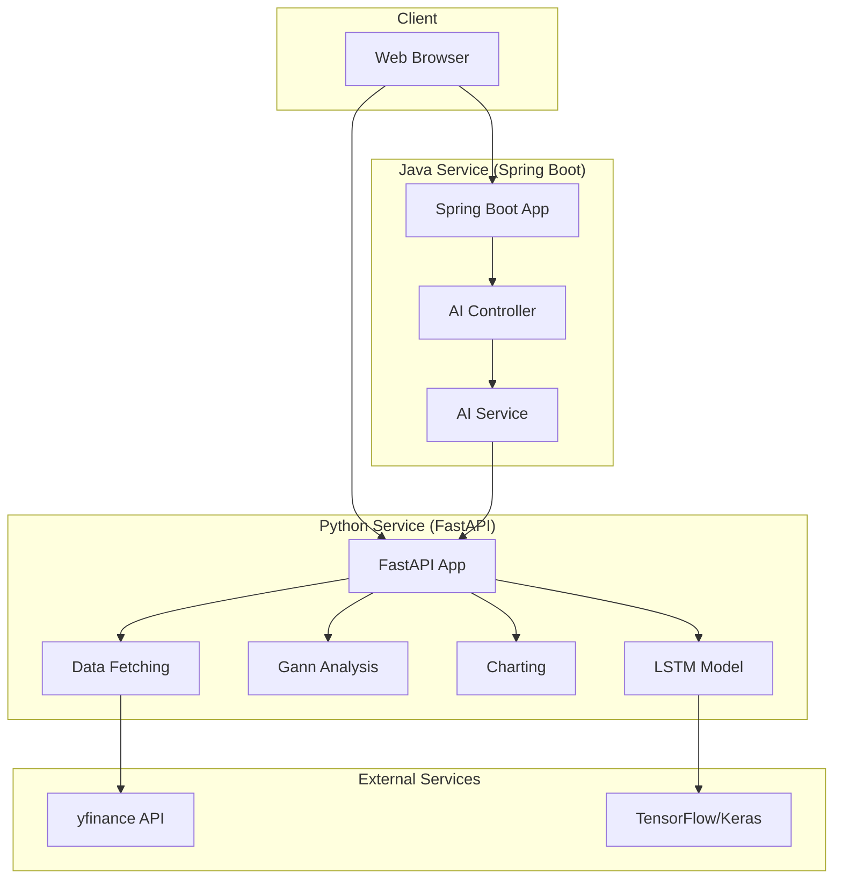
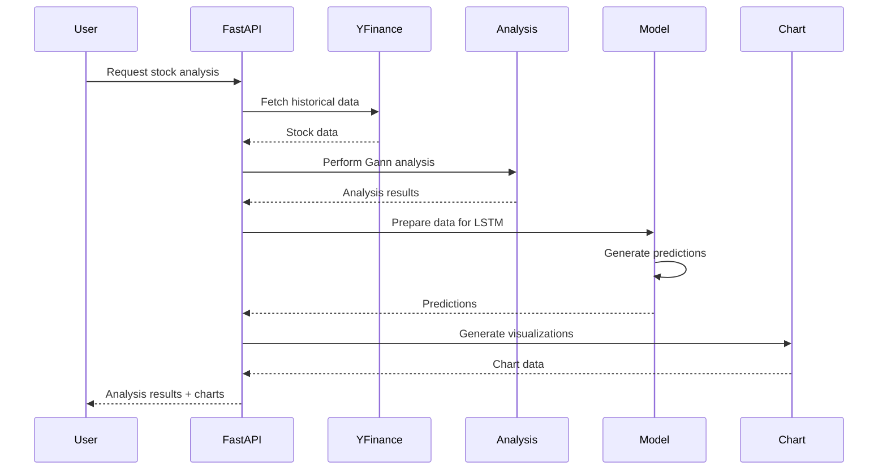

# Stock Analysis Application

An AI-powered stock market analysis application that combines technical analysis with machine learning for price prediction, featuring LSTM neural networks, Gann analysis, and interactive charting.

## Overview

The Stock Analysis App is a multi-stack application that fetches historical stock data, performs technical analysis, and uses machine learning to predict future stock prices. It combines Python (FastAPI) for AI/ML services with Java (Spring Boot) for backend services.

## Project Status

**Status:** Prototype

**Development Period:** March 2025

## Key Features

### Core Functionality

- **Historical Data Fetching**: Retrieves stock data using yfinance
- **Technical Analysis**: Gann analysis for trend identification
- **Interactive Charting**: Plotly charts for data exploration
- **Static Visualization**: Matplotlib charts for analysis
- **LSTM Prediction Model**: Neural network for price prediction
- **Data Preparation**: Sliding window approach for time series
- **Multi-Stack Architecture**: Python FastAPI + Java backend

### AI/ML Features

- **LSTM Neural Network**: Long Short-Term Memory for time series
- **Data Preprocessing**: Normalization and sequence generation
- **Model Training**: Configurable training parameters
- **Prediction Generation**: Future price predictions

### Technical Analysis

- **Gann Analysis**: Trendline identification
- **Support/Resistance Levels**: Key price levels
- **Chart Patterns**: Technical indicator visualization

## Technology Stack

### Python (AI/ML Service)
- **Framework**: FastAPI
- **ML Library**: TensorFlow/Keras
- **Data Processing**: pandas, numpy
- **Charting**: Matplotlib, Plotly
- **Data Source**: yfinance

### Java (Backend Service)
- **Framework**: Spring Boot
- **REST API**: Spring Web
- **Build Tool**: Maven

### Infrastructure
- **Docker**: Containerization
- **Docker Compose**: Multi-service orchestration

## Architecture

### System Architecture



### Project Structure

```
stock_app/
├── ai-python/              # Python FastAPI service
│   ├── app.py              # FastAPI application
│   ├── api.py              # API routes
│   ├── data/               # Data fetching
│   │   └── stock_data.py
│   ├── analysis/           # Technical analysis
│   │   └── gann_analysis.py
│   ├── charts/             # Charting
│   │   └── charting.py
│   └── models/             # ML models
│       └── prediction_model.py
├── backend-java/           # Java Spring Boot service
│   └── src/main/java/
│       └── controllers/
│           └── AiController.java
└── docker/                 # Docker configuration
    ├── docker-compose.yml
    ├── ai.Dockerfile
    └── backend.Dockerfile
```

## LSTM Model Architecture

### Model Design

- **Type**: Long Short-Term Memory (LSTM) neural network
- **Purpose**: Time series forecasting for stock prices
- **Input**: Historical price sequences
- **Output**: Future price predictions

### Data Preparation

1. **Data Fetching**: Get historical stock data
2. **Normalization**: Scale data to [0, 1] range
3. **Sequence Creation**: Sliding window approach
4. **Train/Test Split**: Separate training and testing data
5. **Model Training**: Train LSTM on sequences

### Model Architecture

```python
# LSTM Model Structure
- Input Layer: Sequence of historical prices
- LSTM Layers: Multiple LSTM layers for pattern learning
- Dense Layers: Fully connected layers
- Output Layer: Single value (predicted price)
```

## Gann Analysis

### Gann Theory

- **Trendlines**: Identify support and resistance
- **Angles**: Gann angles for trend analysis
- **Price Levels**: Key price points
- **Time Cycles**: Time-based patterns

### Implementation

- Calculates Gann lines from price data
- Identifies support/resistance levels
- Visualizes trends on charts
- Overlays on price charts

## Data Flow

### Stock Analysis Flow



## API Endpoints

### Python FastAPI Endpoints

- `GET /stock-data/{symbol}` - Fetch stock data
- `GET /gann-analysis/{symbol}` - Perform Gann analysis
- `GET /predict/{symbol}` - Generate price predictions
- `GET /chart/{symbol}` - Get chart data

### Java Spring Boot Endpoints

- `POST /api/ai/analyze` - AI analysis endpoint
- `GET /api/ai/status` - Service status

## Docker Deployment

### Multi-Service Setup

- **Python Service**: FastAPI container
- **Java Service**: Spring Boot container
- **Docker Compose**: Orchestrates both services

### Container Configuration

- Separate Dockerfiles for each service
- Docker Compose for service coordination
- Network configuration for inter-service communication

## Project Statistics

| Metric | Value |
|--------|-------|
| **Python Files** | 10+ |
| **Java Files** | 5+ |
| **Services** | 2 (Python FastAPI, Java Spring Boot) |
| **ML Models** | 1 (LSTM) |
| **Chart Types** | 2 (Matplotlib, Plotly) |

## Code Samples

See the [code-samples](./code-samples/) directory for examples of:
- LSTM model implementation
- Gann analysis calculations
- Data fetching with yfinance
- Charting with Matplotlib and Plotly
- FastAPI route definitions
- Java Spring Boot controllers

## Case Studies

- [LSTM Stock Prediction](./case-studies/lstm-stock-prediction.md)
- [Multi-Stack Architecture](./case-studies/multi-stack-architecture.md)

---

**Note:** This is a showcase repository. The actual production codebase remains private.
