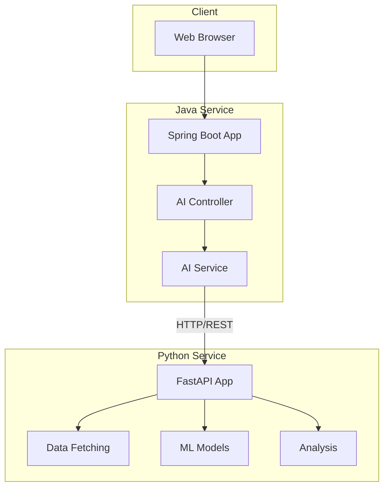

# Case Study: Multi-Stack Architecture (Python + Java)

## Problem

The Stock Analysis application needed:
- **Python**: For AI/ML services (LSTM, data processing, charting)
- **Java**: For backend services (Spring Boot ecosystem, enterprise features)
- **Separation**: Different services with different requirements
- **Integration**: Services need to communicate
- **Deployment**: Containerized deployment

The challenge was integrating two different technology stacks while maintaining:
- Clear service boundaries
- Efficient communication
- Independent scaling
- Easy deployment

## Solution

Implemented a **multi-stack microservices architecture** with:
- **Python FastAPI Service**: AI/ML processing
- **Java Spring Boot Service**: Backend API
- **Docker**: Containerization
- **Docker Compose**: Service orchestration

### Architecture Overview



### Service Responsibilities

#### Python FastAPI Service

**Responsibilities**:
- Stock data fetching (yfinance)
- LSTM model training and prediction
- Gann analysis calculations
- Chart generation (Matplotlib, Plotly)
- Data preprocessing

**Technology Stack**:
- FastAPI (async Python web framework)
- TensorFlow/Keras (ML)
- pandas, numpy (data processing)
- yfinance (stock data)

**API Endpoints**:
```python
@app.get("/stock-data/{symbol}")
async def get_stock_data(symbol: str):
    # Fetch and return stock data
    pass

@app.get("/predict/{symbol}")
async def predict_prices(symbol: str):
    # Generate price predictions
    pass

@app.get("/gann-analysis/{symbol}")
async def gann_analysis(symbol: str):
    # Perform Gann analysis
    pass
```

#### Java Spring Boot Service

**Responsibilities**:
- Main API gateway
- Business logic orchestration
- User management
- Request routing to Python service
- Data aggregation

**Technology Stack**:
- Spring Boot
- Spring Web (REST API)
- Maven (build tool)

**API Endpoints**:
```java
@RestController
@RequestMapping("/api/ai")
public class AiController {
    
    @Autowired
    private AiService aiService;
    
    @PostMapping("/analyze")
    public ResponseEntity<?> analyzeStock(@RequestBody StockRequest request) {
        // Orchestrate analysis via Python service
        return aiService.analyzeStock(request);
    }
}
```

### Service Communication

#### HTTP/REST Integration

**Java → Python**:
```java
@Service
public class AiService {
    private final RestTemplate restTemplate;
    private final String pythonServiceUrl = "http://python-service:8000";
    
    public AnalysisResult analyzeStock(String symbol) {
        // Call Python service
        String url = pythonServiceUrl + "/predict/" + symbol;
        return restTemplate.getForObject(url, AnalysisResult.class);
    }
}
```

**Python → Java** (if needed):
```python
import requests

def call_java_service(endpoint, data):
    response = requests.post(
        f"http://java-service:8080/api/{endpoint}",
        json=data
    )
    return response.json()
```

### Docker Deployment

#### Docker Compose Configuration

```yaml
version: '3.8'

services:
  python-service:
    build:
      context: ./ai-python
      dockerfile: ../docker/ai.Dockerfile
    ports:
      - "8000:8000"
    environment:
      - PYTHONUNBUFFERED=1
    volumes:
      - ./ai-python:/app

  java-service:
    build:
      context: ./backend-java
      dockerfile: ../docker/backend.Dockerfile
    ports:
      - "8080:8080"
    environment:
      - PYTHON_SERVICE_URL=http://python-service:8000
    depends_on:
      - python-service
```

#### Dockerfile Examples

**Python Service**:
```dockerfile
FROM python:3.9-slim

WORKDIR /app

COPY requirements.txt .
RUN pip install --no-cache-dir -r requirements.txt

COPY . .

CMD ["uvicorn", "app:app", "--host", "0.0.0.0", "--port", "8000"]
```

**Java Service**:
```dockerfile
FROM openjdk:17-jdk-slim

WORKDIR /app

COPY target/*.jar app.jar

EXPOSE 8080

ENTRYPOINT ["java", "-jar", "app.jar"]
```

## Benefits

### 1. Right Tool for the Job
- **Python**: Best for AI/ML, data science
- **Java**: Best for enterprise backend, Spring ecosystem
- Each service uses optimal technology

### 2. Independent Scaling
- Scale Python service for ML workloads
- Scale Java service for API requests
- Independent resource allocation

### 3. Technology Flexibility
- Use best libraries for each domain
- No technology constraints
- Easy to swap implementations

### 4. Team Collaboration
- Python team works on ML
- Java team works on backend
- Clear service boundaries

### 5. Deployment Flexibility
- Deploy services independently
- Different deployment strategies
- Container orchestration ready

## Results

- **Service Separation**: Clear boundaries achieved
- **Communication**: Efficient HTTP/REST integration
- **Deployment**: Successful containerization
- **Scalability**: Independent scaling possible
- **Maintainability**: Easier to maintain and update

## Challenges and Solutions

### Challenge 1: Service Communication
**Problem**: Services need to communicate efficiently
**Solution**:
- HTTP/REST for synchronous calls
- Message queue for async (future)
- Service discovery (Docker networking)

### Challenge 2: Data Consistency
**Problem**: Data shared between services
**Solution**:
- Each service owns its data
- API contracts for data exchange
- Event-driven updates (future)

### Challenge 3: Error Handling
**Problem**: Errors across service boundaries
**Solution**:
- Proper HTTP status codes
- Error propagation
- Circuit breakers (future)

### Challenge 4: Deployment Complexity
**Problem**: Multiple services to deploy
**Solution**:
- Docker Compose for local
- Kubernetes for production (future)
- CI/CD pipelines

## Future Enhancements

- **Message Queue**: Async communication (RabbitMQ, Kafka)
- **Service Mesh**: Advanced service communication (Istio)
- **API Gateway**: Centralized API management
- **Monitoring**: Distributed tracing (Jaeger, Zipkin)
- **Load Balancing**: Service load distribution
- **Caching**: Redis for shared cache
- **Database**: Separate databases per service
