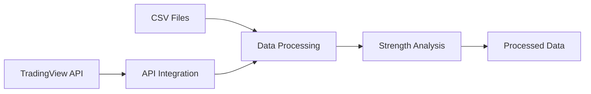

# TradingView Integration

Tools and utilities for integrating with and extending TradingView functionality, including data processing and strength analysis.

## Overview

The TradingView Integration project provides tools for working with TradingView data, processing market strength information, and extending TradingView functionality through custom integrations.

## Project Status

**Status:** Prototype

**Development Period:** March 2025

## Key Features

### Core Functionality

- **TradingView API Integration**: Connect to TradingView services
- **Data Processing**: Process and analyze TradingView data
- **Strength Data Analysis**: Analyze market strength indicators
- **CSV Data Handling**: Process historical strength data
- **Data Transformation**: Convert and format data for analysis

### Data Processing

- **CSV Processing**: Read and process CSV data files
- **Data Transformation**: Convert data formats
- **Strength Calculations**: Calculate market strength metrics
- **Historical Analysis**: Process historical data

## Technology Stack

### Backend
- **Language**: Python
- **Libraries**: pandas, numpy (for data processing)
- **Data Formats**: CSV

### Data Analysis
- **pandas**: Data manipulation and analysis
- **CSV Processing**: Reading and writing CSV files
- **Data Transformation**: Format conversion

## Architecture

### Application Structure

```
trading_view/
├── api.py                  # API integration
├── test.py                 # Testing utilities
├── scripts/                # Utility scripts
├── strength_data_v1.csv    # Historical data
├── strength_data_v2.csv   # Updated data
└── requirements.txt        # Dependencies
```

### Data Flow



## TradingView Integration

### API Integration

- Connect to TradingView services
- Fetch market data
- Retrieve indicators
- Process real-time data

### Data Processing

- Parse TradingView data formats
- Transform data structures
- Calculate derived metrics
- Generate analysis reports

## Strength Data Analysis

### Features

- **Historical Strength Data**: Process CSV files with strength indicators
- **Version Management**: Multiple versions of strength data
- **Data Analysis**: Calculate trends and patterns
- **Export Capabilities**: Export processed data

### Data Files

- `strength_data_v1.csv`: Initial strength data
- `strength_data_v2.csv`: Updated strength data
- `full_strength_data_2025.csv`: Complete 2025 dataset

## Project Statistics

| Metric | Value |
|--------|-------|
| **Python Files** | 3+ |
| **Data Files** | 3+ CSV files |
| **Integration Type** | API + Data Processing |

## Code Samples

See the [code-samples](./code-samples/) directory for examples of:
- TradingView API integration
- CSV data processing
- Strength data analysis
- Data transformation utilities

---

**Note:** This is a showcase repository. The actual production codebase remains private.
